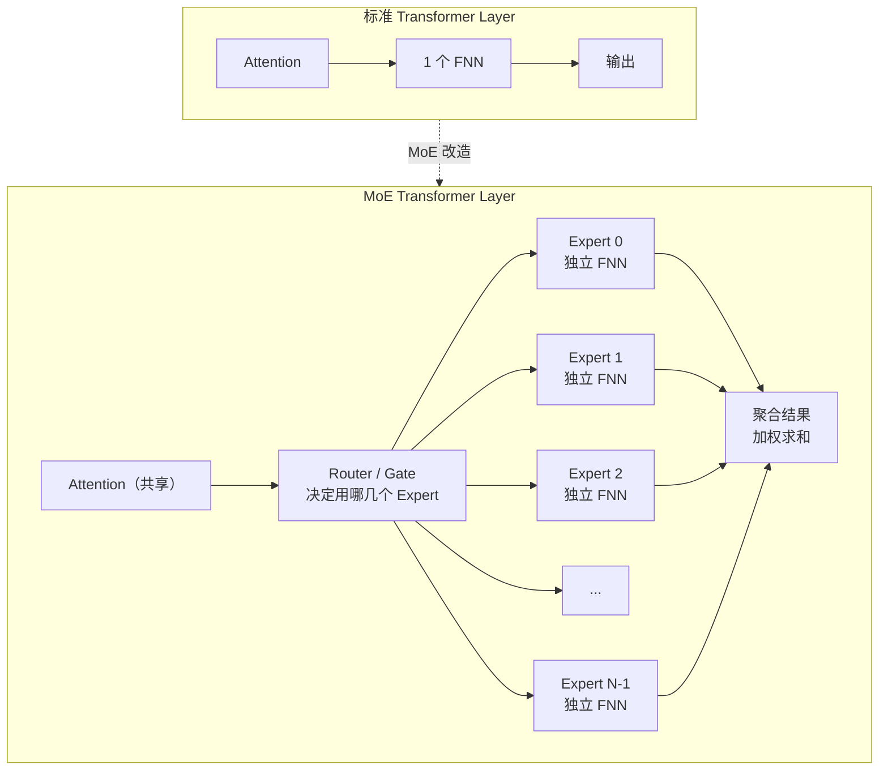
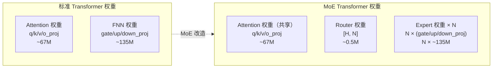
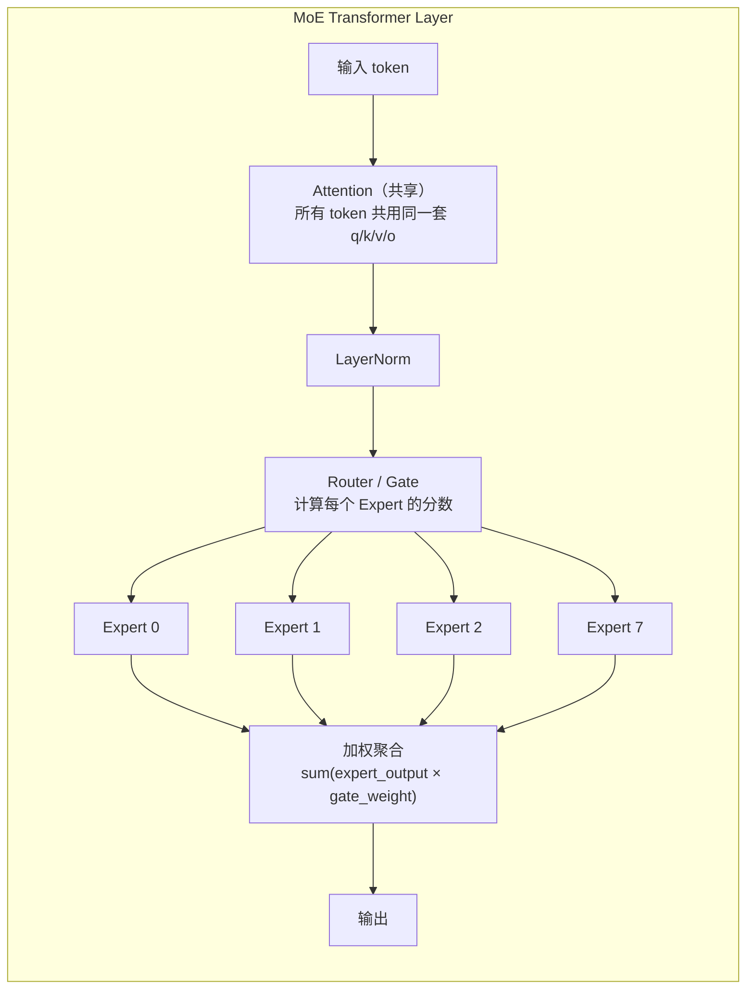
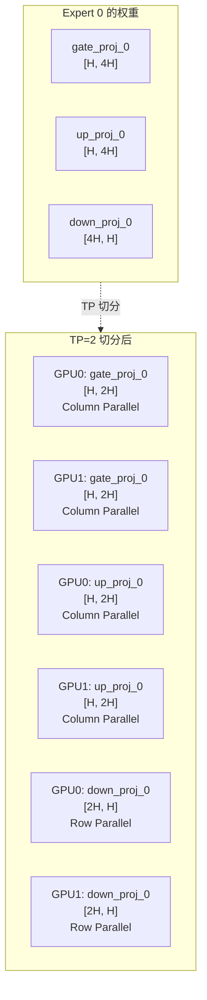
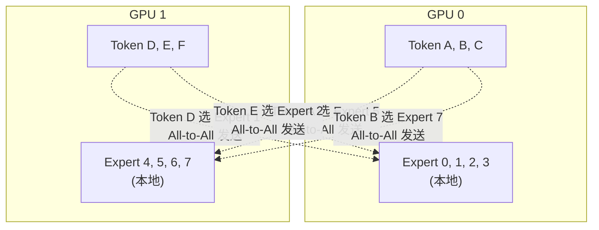
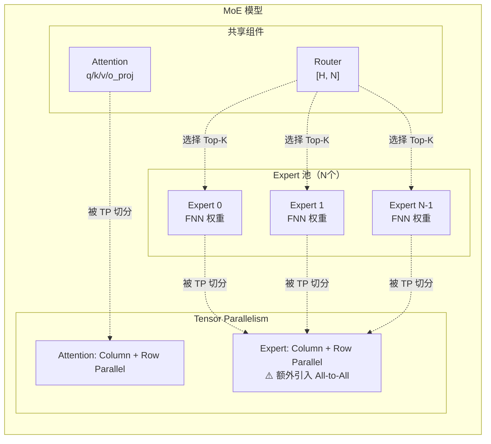
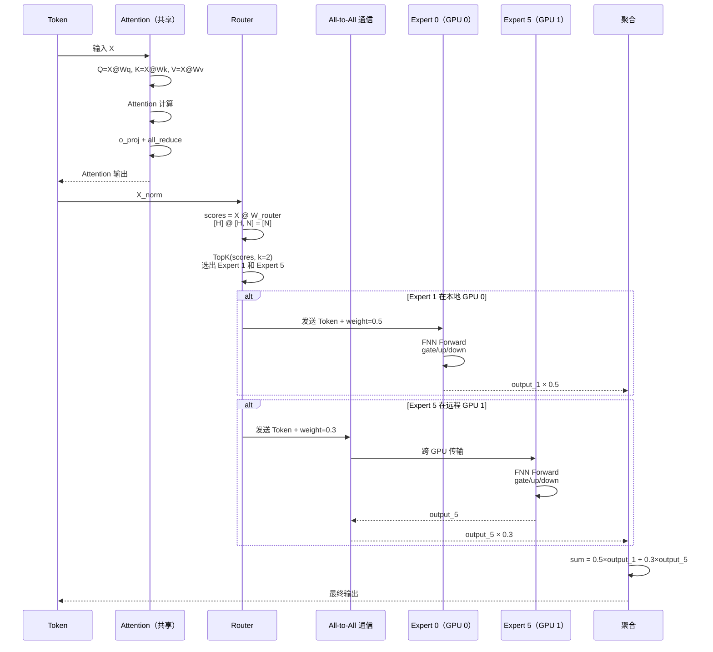

# Expert（专家）与 TP、Attention、FNN、权重 的关系

---

## 一、Expert 是什么？

**Expert = 一个独立的 FNN**

在标准 Transformer 中，每层只有 **1 个 FNN**。在 MoE（Mixture of Experts）模型中，这层 FNN 被替换为 **N 个 Expert FNN + 1 个 Router（路由网络）**。



---

## 二、Expert 与 FNN 的关系

### 2.1 Expert = FNN 的"克隆体"

```
标准 FNN（1个）:
    ┌─────────────────────────────────────┐
    │  gate_proj  up_proj  down_proj      │
    │  [H,4H]    [H,4H]   [4H,H]         │
    └─────────────────────────────────────┘

MoE Expert（N个，每个都是独立的 FNN）:
    ┌─────────────────────────────────────┐
    │  Expert 0:  gate_proj_0  up_proj_0  down_proj_0  │
    │             [H,4H]      [H,4H]     [4H,H]        │
    ├─────────────────────────────────────┤
    │  Expert 1:  gate_proj_1  up_proj_1  down_proj_1  │
    │             [H,4H]      [H,4H]     [4H,H]        │
    ├─────────────────────────────────────┤
    │  Expert 2:  gate_proj_2  up_proj_2  down_proj_2  │
    │             [H,4H]      [H,4H]     [4H,H]        │
    ├─────────────────────────────────────┤
    │  ...                                │
    ├─────────────────────────────────────┤
    │  Expert N-1: gate_proj_N  up_proj_N  down_proj_N │
    │              [H,4H]      [H,4H]     [4H,H]       │
    └─────────────────────────────────────┘
    
    每个 Expert 内部结构和标准 FNN 完全一致！
```

### 2.2 核心差异

| | 标准 FNN | MoE Expert |
|---|---------|-----------|
| **数量** | 每 Layer 1 个 | 每 Layer N 个（如 8/16/64） |
| **参数是否独立** | — | 每个 Expert 有独立权重 |
| **计算方式** | 所有 token 走同一个 FNN | 每个 token 选 Top-K 个 Expert |
| **参数量** | 小 | 大（N 倍） |
| **活跃参数量** | 全部参与 | 只激活 Top-K 个 Expert |

---

## 三、Expert 与权重的关系

### 3.1 权重构成对比



### 3.2 具体数字（以 Mixtral 8×7B 为例）

```
Mixtral 8×7B:
    - 8 个 Expert
    - 每个 Expert = 1 个标准 FNN（约 7B 参数的 FNN 部分）
    - 每 token 激活 Top-2 Expert
    
总参数量:
    Attention（共享）:              ~ 0.5 B
    Router:                         ~ 0.01 B
    8 × Expert FNN:                 ~ 8 × 7 B = 56 B
    ─────────────────────────────────────────
    总计:                           ~ 56.5 B
    
活跃参数量（每个 token）:
    Attention:                      ~ 0.5 B
    Router:                         ~ 0.01 B
    2 × Expert FNN:                 ~ 2 × 7 B = 14 B
    ─────────────────────────────────────────
    活跃总计:                       ~ 14.5 B  ← 远小于总参数！
```

### 3.3 权重形状对比

| 权重 | 标准 Transformer | MoE（N=8） |
|------|-----------------|-----------|
| q_proj | [4096, 4096] × 1 | [4096, 4096] × 1（共享） |
| k_proj | [4096, 4096] × 1 | [4096, 4096] × 1（共享） |
| v_proj | [4096, 4096] × 1 | [4096, 4096] × 1（共享） |
| o_proj | [4096, 4096] × 1 | [4096, 4096] × 1（共享） |
| gate_proj | [4096, 11008] × 1 | [4096, 11008] × **8**（每个 Expert 独立） |
| up_proj | [4096, 11008] × 1 | [4096, 11008] × **8**（每个 Expert 独立） |
| down_proj | [11008, 4096] × 1 | [11008, 4096] × **8**（每个 Expert 独立） |
| router | 无 | [4096, 8] × 1 |

---

## 四、Expert 与 Attention 的关系

### 4.1 Attention 通常是"共享的"



### 4.2 为什么 Attention 不 MoE？

| | Attention | Expert FNN |
|---|-----------|-----------|
| **是否共享** | ✅ 是，所有 token 共用 | ❌ 否，每个 Expert 独立 |
| **原因** | Attention 负责全局关系，需要看到所有 token | FNN 负责局部特征变换，可以分工 |
| **参数量** | 相对小（~67M） | 相对大（~135M × N） |
| **MoE 收益** | 低 | 高（FNN 占模型 2/3 参数） |

> **关键洞察**：MoE 只改造 FNN，不改造 Attention，因为 **FNN 参数量大、计算独立、易于拆分**。

---

## 五、Expert 与 TP 的关系

### 5.1 Expert 权重的 TP 切分

Expert 本质就是 FNN，所以 TP 切分方式和 FNN **完全一致**：



### 5.2 MoE + TP 的特殊挑战：All-to-All 通信

TP 切分 Expert 后，引入了新的通信模式：**All-to-All**



| 通信类型 | 标准 Transformer + TP | MoE + TP |
|---------|---------------------|---------|
| **All-Reduce** | ✅ o_proj / down_proj 后汇总 | ✅ 同左 |
| **All-to-All** | ❌ 不需要 | ✅ Token 需路由到目标 Expert 所在 GPU |

### 5.3 为什么 MoE 引入 All-to-All？

```
场景：8 个 Expert 分布在 2 张 GPU 上
    GPU 0: Expert 0, 1, 2, 3
    GPU 1: Expert 4, 5, 6, 7

Token A（在 GPU 0）的 Router 输出：
    Expert 1: 0.5  ← 在 GPU 0，本地计算
    Expert 5: 0.3  ← 在 GPU 1，需要发送过去！
    
All-to-All 通信:
    GPU 0 发送 Token A 到 GPU 1
    GPU 1 发送 Token D 到 GPU 0
    ...
```

---

## 六、五者关系总览图



---

## 七、完整数据流（MoE + TP）



---

## 八、一句话关系总结

| 实体 | 一句话定义 | 与 Expert 的关系 |
|------|-----------|-----------------|
| **权重** | 可学习的矩阵参数 | Expert 的"私有财产"，每个 Expert 有独立的 FNN 权重 |
| **Attention** | 全局关系计算 | **不被 Expert 替换**，所有 token 共享同一套 Attention |
| **FNN** | 局部特征变换 | **被 Expert 替换**，1 个 FNN → N 个 Expert FNN |
| **TP** | 权重切分到多卡 | 对 Expert 权重做 Column/Row 切分，同时引入 All-to-All 通信 |
| **Expert** | 独立的 FNN "专家" | 每个 Expert = 1 套 FNN 权重，负责处理特定类型的 token |
| **Router** | 路由/门控网络 | 决定每个 token 去哪个 Expert，权重为 [H, N] |

> **核心关系链**：
> 
> **模型太大 → 用 MoE 把 FNN 拆成 N 个 Expert → 每个 Expert 有独立 FNN 权重 → 用 TP 把 Expert 权重切分到多卡 → Router 决定 token 去哪个 Expert → 引入 All-to-All 跨 GPU 通信**


标准的MoE Transformer层的计算流程是：

  1. 输入 → Attention → 残差连接 + LayerNorm
  2. Attention输出 → Router → 计算Top-K专家
  3. 根据Router结果 → 分发到对应的Expert FNN
  4. Expert FNN计算 → 加权聚合 → 残差连接 + LayerNorm


    所以流程是：

  1. 边侧 NPU0 (PP rank 0) 执行 _model_forward，计算到某个中间层
  2. 边侧 NPU0 返回 IntermediateTensors（因为不是 last rank）
  3. 通过 PP send 把 intermediate tensors 发给云侧 NPU0
  4. 云侧 NPU0 (PP rank 1) 通过 PP recv 接收 intermediate tensors
  5. 云侧 NPU0 把 intermediate tensors 传入 _model_forward 继续计算
  6. 在云侧内部，通过 TP 把计算分到云侧各 rank
  7. 云侧 NPU0 计算完成后（它是 last rank），返回 logits 和 hidden_states


  二、完整调用链：云侧收到张量 → 计算 → 回到 rank0 → 发回边侧
  Step 1: 边侧 NPU0 执行前半部分层，通过 PP 发给云侧
  调用栈：
  # vllm/v1/worker/gpu_worker.py:660
  GPUWorker.execute_model(scheduler_output)
  ├── is_first_rank = True          # PP rank 0，跳过 recv
  ├── model_runner.execute_model(scheduler_output, intermediate_tensors=None)
  │   └── _model_forward()
  │       └── LlamaModel.forward()
  │           ├── embed_input_ids(input_ids)      # 只在 first_rank 做 embedding
  │           ├── for layer in layers[0:split]:   # 边侧负责的前半部分层
  │           └── return IntermediateTensors({"hidden_states": h, "residual": r})
  │
  # model_runner 返回 IntermediateTensors，不是 ModelRunnerOutput
  # vllm-ascend/worker/model_runner_v1.py:1389
  if not get_pp_group().is_last_rank or is_edge_cloud_first_stage(intermediate_tensors):
      return hidden_states   # ← 返回 IntermediateTensors
  │
  # 回到 GPUWorker.execute_model:734
  assert isinstance(output, IntermediateTensors)
  # vllm/v1/worker/gpu_worker.py:742
  self._pp_send_work = get_pp_group().isend_tensor_dict(
      output.tensors, all_gather_group=get_tp_group()
  )   # ← 【非阻塞发送】把 hidden_states + residual 发给云侧 NPU0
  return None
  关键： 边侧 NPU0 把 IntermediateTensors（hidden_states + residual）通过 isend_tensor_dict 异步发送给 PP 下一个 rank（云侧 NPU0）。


  三、总结：你问的几个关键点
   问题                            答案（结合代码）
  ━━━━━━━━━━━━━━━━━━━━━━━━━━━━━━━━━━━━━━━━━━━━━━━━━━━━━━━━━━━━━━━━━━━━━━━━━━━━━━━━━━━━━━━━━━━━━━━━━━━━━━━━━━━━━━━━━━━━━━━━━━━━━━━━━━━━━━━━━━━━━━━━━━━
   云侧怎么从 PP 对端收张量？      GPUWorker.execute_model() → get_pp_group().irecv_tensor_dict() → dist.recv on HCCL PP group
   怎么分到不同 rank 做计算？      云侧 NPU0 把 intermediate tensors 传入 _model_forward()，云侧内部通过 TP（ColumnParallelLinear/RowParallelLinear
                                   ）自动切分到各 TP rank
   计算完怎么回到云侧 rank0？      云侧内部通过 TP all-reduce（tensor_model_parallel_all_reduce() → dist.all_reduce on HCCL TP group）把 partial su…
                                   聚合成完整结果，所有 TP rank 都有全量结果
   最后怎么发回给边侧？            不是发完整张量！ <br>• 默认：sample_tokens 阶段，云侧 NPU0 采样后通过 torch.distributed.broadcast 把 sampled toke
                                   n ids 发给边侧 NPU0 <br>• external_launcher 模式：execute_model 阶段通过 broadcast_tensor_dict 把 logits 广播给边
                                   侧 NPU0，边侧自己采样
   Executor 从哪个 rank 取结果？   _get_output_rank() 在边云模式下固定返回 0（边侧 NPU0）

• 基于代码追踪，你的配置（TP=8, DP=1, PP=1, enable_expert_parallel）在单节点 8 卡 NPU 上的通信组结构如下：
  ────────────────────────────────────────────────────────────────────────────────────────────────────────────────────────────────────────────────────────────────────────────────────────────────
  一、基础拓扑：world_size = 8
  # parallel_state.py:1682
  all_ranks = torch.arange(world_size).reshape(
      -1,                    # external_dp_size = 1
      data_parallel_size,    # 1
      pipeline_model_parallel_size,  # 1
      prefill_context_model_parallel_size,  # 1
      tensor_model_parallel_size,  # 8
  )
  # shape = (1, 1, 1, 1, 8)
  # all_ranks = [[[[[0, 1, 2, 3, 4, 5, 6, 7]]]]]
  由于 DP=1, PP=1, PCP=1, TP=8，所有 8 个 rank 都在同一个节点内。
  ────────────────────────────────────────────────────────────────────────────────────────────────────────────────────────────────────────────────────────────────────────────────────────────────
  二、各通信组的构成
   通信组   构建方式                                            Ranks               Group Size   实际作用
  ━━━━━━━━━━━━━━━━━━━━━━━━━━━━━━━━━━━━━━━━━━━━━━━━━━━━━━━━━━━━━━━━━━━━━━━━━━━━━━━━━━━━━━━━━━━━━━━━━━━━━━━━━━━━━━━━━━━━━━━━━━
   World    torch.distributed.init_process_group                [0,1,2,3,4,5,6,7]   8            全局 barrier、初始化
   TP       all_ranks.view(-1, 8).unbind(0)                     [0,1,2,3,4,5,6,7]   8            Attention 层的 all_reduce
   EP       all_ranks.transpose(1,2).reshape(-1, 8).unbind(0)   [0,1,2,3,4,5,6,7]   8            MoE 层的 all_to_all
   DP       all_ranks.transpose(1,4).reshape(-1, 1).unbind(0)   [0],[1],...,[7]     1            单例 group，无实际 DP 通信
   PP       all_ranks.transpose(2,4).reshape(-1, 1).unbind(0)   [0],[1],...,[7]     1            单例 group，无实际 PP 通信
  ▌ 关键结论：TP group 和 EP group 包含完全相同的 8 个 rank，但它们是两个独立的 HCCL process group，分别服务于 Attention 和 MoE。
  ────────────────────────────────────────────────────────────────────────────────────────────────────────────────────────────────────────────────────────────────────────────────────────────────
  三、MoE 层内：EP 完全替代 TP
  这是最关键的设计。在 FusedMoEParallelConfig.make() 中：
  # vllm/model_executor/layers/fused_moe/config.py:1071-1118
  use_ep = (dp_size_ * pcp_size_ * tp_size_ > 1 and enable_expert_parallel)
  # = (1 * 1 * 8 > 1 and True) = True

  tp_size, tp_rank = flatten_tp_across_dp_and_pcp(tp_size_=8, dp_size_=1, ...)
  # tp_size = 8, tp_rank = 0~7

  if use_ep:
      # 在 EP 模式下，每个设备独立拥有一组完整的 experts，TP 在 MoE 层内被关闭
      ep_size = tp_size      # ep_size = 8
      ep_rank = tp_rank      # ep_rank = 0~7
      return FusedMoEParallelConfig(
          tp_size=1,          # ← MoE 层内 TP 被重置为 1！
          tp_rank=0,
          ep_size=8,
          ep_rank=ep_rank,    # 0~7
          ...
      )
  对 Expert 权重的影响
  # determine_expert_map(ep_size=8, ep_rank, global_num_experts=256)
  local_num_experts = 256 // 8 = 32
   NPU   EP Rank   持有的 Experts                Expert 权重是否被 TP 切分
  ━━━━━━━━━━━━━━━━━━━━━━━━━━━━━━━━━━━━━━━━━━━━━━━━━━━━━━━━━━━━━━━━━━━━━━━━━
   0     0         0, 8, 16, ..., 248 (32 个)    否 (tp_size=1)
   1     1         1, 9, 17, ..., 249 (32 个)    否 (tp_size=1)
   ...   ...       ...                           ...
   7     7         7, 15, 23, ..., 255 (32 个)   否 (tp_size=1)
  对比 EP=False 的情况：
  • 如果 --enable-expert-parallel 不开启，MoE 层内 tp_size=8，每个 expert 的 w13/w2 会被 Column/Row Parallel 切分为 8 份，每层需要 TP all-reduce
  • 开启 EP 后，MoE 层内 tp_size=1，expert 权重完整，没有 TP all-reduce，改为 EP all-to-all 路由 token
  ────────────────────────────────────────────────────────────────────────────────────────────────────────────────────────────────────────────────────────────────────────────────────────────────
  四、Attention 层：TP=8 保持不变
  与 MoE 层不同，Attention 层的 DeepseekV2MLAAttention 仍然使用原始的 TP=8：
  # deepseek_v2.py:843
  tp_size = get_tensor_model_parallel_world_size()  # = 8
  self.num_local_heads = num_heads // tp_size       # 每卡负责 1/8 的 heads

  # Projection 层的 TP 切分：
  self.q_b_proj = ColumnParallelLinear(...)   # 输出维度切 8 份
  self.kv_b_proj = ColumnParallelLinear(...)  # 输出维度切 8 份
  self.o_proj = RowParallelLinear(...)        # 输入维度切 8 份，输出后 all_reduce
  Attention 层的通信：
  • o_proj (RowParallelLinear) 后：tensor_model_parallel_all_reduce → dist.all_reduce(group=TP HCCL group)
  ────────────────────────────────────────────────────────────────────────────────────────────────────────────────────────────────────────────────────────────────────────────────────────────────
  五、MoE 层的通信调用栈
  # DeepseekV2MoE.forward()
  router_logits, _ = self.gate(hidden_states)
  shared_output, fused_out = self.experts(hidden_states, router_logits)
      └── SharedFusedMoE.forward()
          ├── 非 overlap: shared_out = self._shared_experts(hidden_states)
          └── fused_out = FusedMoE.forward(hidden_states, router_logits)
              └── DefaultMoERunner.forward_impl()
                  ├── token_dispatch: all_to_all 发送 token 到 expert 所在 rank
                  │   └── NPUCommunicator.all_to_all(group=EP HCCL group)
                  ├── expert compute: 各 rank 计算本地 32 个 expert
                  └── token_combine: all_reduce + slice 聚合结果
                      └── All2AllManagerBase.combine() / FusedMC2CommImpl
  NPU 上的 EP 通信后端：
   通信类型                   调用路径                                                     实际执行
  ━━━━━━━━━━━━━━━━━━━━━━━━━━━━━━━━━━━━━━━━━━━━━━━━━━━━━━━━━━━━━━━━━━━━━━━━━━━━━━━━━━━━━━━━━━━━━━━━━━━━━━━━━━━━━━━━━━━━━━━━━━━━━━
   EP dispatch                get_ep_group().all_to_all() → NPUCommunicator.all_to_all()   dist.all_to_all(group=HCCL_EP_group)
   EP combine                 All2AllManagerBase.combine() → get_ep_group().all_reduce()   dist.all_reduce(group=HCCL_EP_group)
   TP all-reduce (MoE 输出)   maybe_all_reduce_tensor_model_parallel()                     dist.all_reduce(group=HCCL_TP_group)
  注意：由于 MoE 层内 tp_size=1，maybe_all_reduce_tensor_model_parallel() 在 MoE 层内实际上不做 all-reduce（除非 must_reduce_shared_expert_outputs() 为 True）。
  ────────────────────────────────────────────────────────────────────────────────────────────────────────────────────────────────────────────────────────────────────────────────────────────────
  六、环境变量对通信的影响
   环境变量                          作用                                         对当前配置的影响
  ━━━━━━━━━━━━━━━━━━━━━━━━━━━━━━━━━━━━━━━━━━━━━━━━━━━━━━━━━━━━━━━━━━━━━━━━━━━━━━━━━━━━━━━━━━━━━━━━━━━━━━━━━━━━━━━━━━━━━━━━━━━━━━━━━━━━━━━━━━━━━
   VLLM_ASCEND_ENABLE_FLASHCOMM1=1   启用华为优化的 fused all-to-all/all-reduce   EP 的 dispatch/combine 可能走 dispatch_ffn_combine 融合算子
   HCCL_OP_EXPANSION_MODE="AIV"      HCCL 使用 AIV (AI Vector) 核心做通信扩展     all_to_all/all_reduce 由 AIV 核心 offload，减少 AI Core 占用
   HCCL_BUFFSIZE=512                 HCCL 通信缓冲区 512MB                        8 卡间 EP all-to-all 的 buffer 大小
   USE_MULTI_GROUPS_KV_CACHE=1       多 group KV cache                            影响 MLA KV Cache 的存储和访问模式
  ────────────────────────────────────────────────────────────────────────────────────────────────────────────────────────────────────────────────────────────────────────────────────────────────
  七、总结图
  ┌─────────────────────────────────────────────────────────────────────┐
  │                    单节点 8 卡 NPU (DeepSeek-V4)                     │
  │                                                                     │
  │  ┌─────┐ ┌─────┐ ┌─────┐ ┌─────┐ ┌─────┐ ┌─────┐ ┌─────┐ ┌─────┐ │
  │  │NPU 0│ │NPU 1│ │NPU 2│ │NPU 3│ │NPU 4│ │NPU 5│ │NPU 6│ │NPU 7│ │
  │  └──┬──┘ └──┬──┘ └──┬──┘ └──┬──┘ └──┬──┘ └──┬──┘ └──┬──┘ └──┬──┘ │
  │     │       │       │       │       │       │       │       │      │
  │     └───────┴───────┴───────┴───────┴───────┴───────┴───────┘      │
  │                         │                                           │
  │              TP Group = EP Group = [0,1,2,3,4,5,6,7]               │
  │                         │                                           │
  │     ┌───────────────────┼───────────────────┐                       │
  │     ▼                   ▼                   ▼                       │
  │  Attention 层           │               MoE 层                      │
  │  ───────────            │               ──────                      │
  │  TP=8 ( Column/Row      │               EP=8 (tp_size=1)           │
  │  Parallel + all_reduce )│               each rank: 32 experts      │
  │                         │               all_to_all dispatch/combine │
  │                         │                                           │
  └─────────────────────────────────────────────────────────────────────┘
