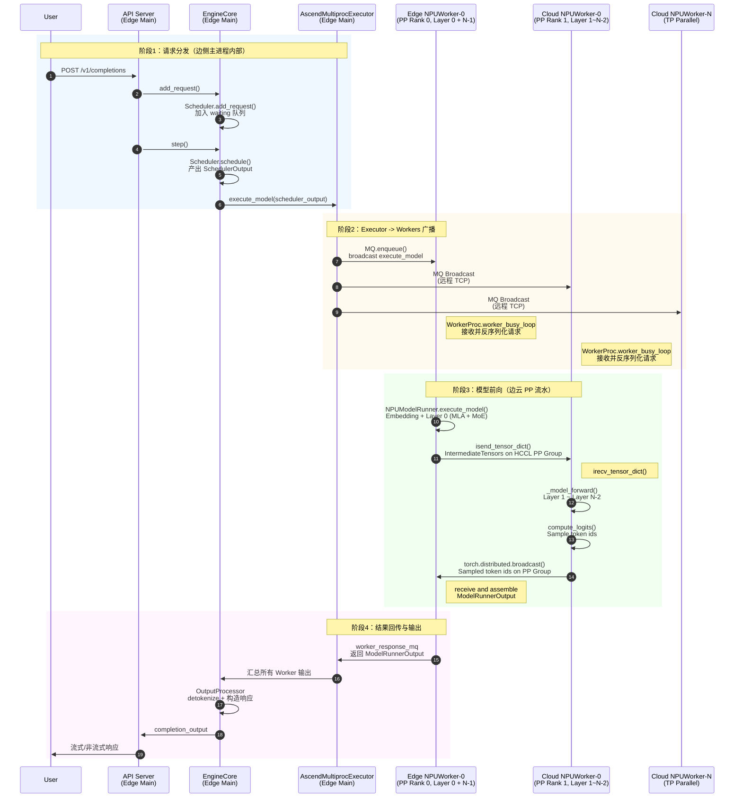

```mermaid
sequenceDiagram
    autonumber
    participant U as User
    participant API as API Server<br/>(Edge Main)
    participant EC as EngineCore<br/>(Edge Main)
    participant EX as AscendMultiprocExecutor<br/>(Edge Main)
    participant EW0 as Edge NPUWorker-0<br/>(PP Rank 0, Layer 0 + N-1)
    participant CW0 as Cloud NPUWorker-0<br/>(PP Rank 1, Layer 1~N-2)
    participant CWN as Cloud NPUWorker-N<br/>(TP Parallel)

    rect rgb(240,248,255)
        Note over U,EX: 阶段1：请求分发（边侧主进程内部）
        U ->>+ API: POST /v1/completions
        API ->> EC: add_request()
        EC ->> EC: Scheduler.add_request()<br/>加入 waiting 队列
        API ->> EC: step()
        EC ->> EC: Scheduler.schedule()<br/>产出 SchedulerOutput
        EC ->> EX: execute_model(scheduler_output)
    end

    rect rgb(255,250,240)
        Note over EX,EW0: 阶段2：Executor -> Workers 广播
        EX ->> EW0: MQ.enqueue()<br/>broadcast execute_model
        EX ->> CW0: MQ Broadcast<br/>(远程 TCP)
        EX ->> CWN: MQ Broadcast<br/>(远程 TCP)
        Note right of EW0: WorkerProc.worker_busy_loop<br/>接收并反序列化请求
        Note right of CW0: WorkerProc.worker_busy_loop<br/>接收并反序列化请求
    end

    rect rgb(240,255,240)
        Note over EW0,CW0: 阶段3：模型前向（边云 PP 流水）
        EW0 ->> EW0: NPUModelRunner.execute_model()<br/>Embedding + Layer 0 (MLA + MoE)
        EW0 ->> CW0: isend_tensor_dict()<br/>IntermediateTensors on HCCL PP Group
        Note right of CW0: irecv_tensor_dict()

        CW0 ->> CW0: _model_forward()<br/>Layer 1 ~ Layer N-2
        CW0 ->> CW0: compute_logits()<br/>Sample token ids

        CW0 ->> EW0: torch.distributed.broadcast()<br/>Sampled token ids on PP Group
        Note right of EW0: receive and assemble<br/>ModelRunnerOutput
    end

    rect rgb(255,245,255)
        Note over EW0,EX: 阶段4：结果回传与输出
        EW0 ->> EX: worker_response_mq<br/>返回 ModelRunnerOutput
        EX ->> EC: 汇总所有 Worker 输出
        EC ->> EC: OutputProcessor<br/>detokenize + 构造响应
        EC ->> API: completion_output
        API ->> U: 流式/非流式响应
    end
```
