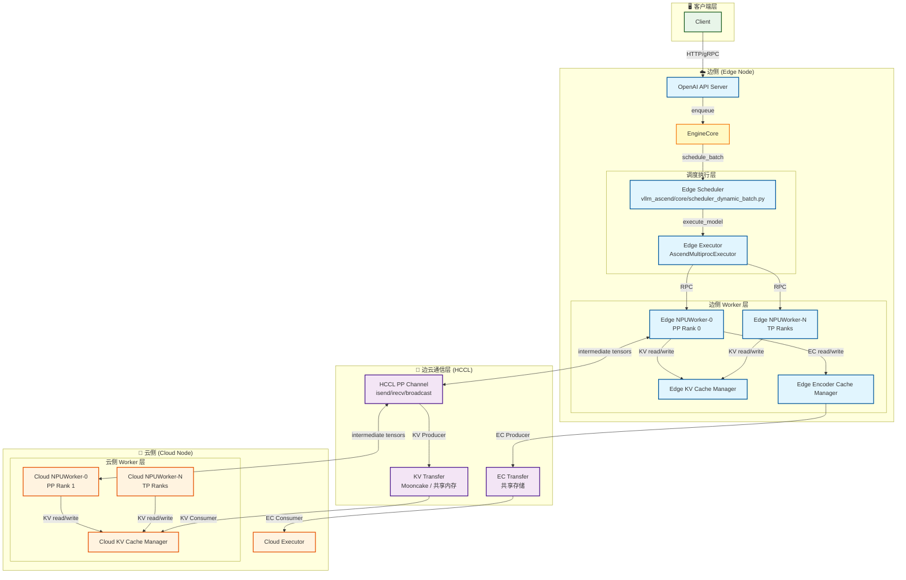

```mermaid
graph TB
    subgraph Client["🖥️ 客户端层"]
        C[Client]
    end

    subgraph Edge["☁️ 边侧 (Edge Node)"]
        direction TB
        API[OpenAI API Server]
        EC[EngineCore]

        subgraph SchedExec["调度执行层"]
            SCHED[Edge Scheduler<br/>vllm_ascend/core/scheduler_dynamic_batch.py]
            EXEC[Edge Executor<br/>AscendMultiprocExecutor]
        end

        subgraph EdgeWorker["边侧 Worker 层"]
            EW0[Edge NPUWorker-0<br/>PP Rank 0]
            EWN[Edge NPUWorker-N<br/>TP Ranks]
            EKV[Edge KV Cache Manager]
            EEC[Edge Encoder Cache Manager]
        end
    end

    subgraph Cloud["🏢 云侧 (Cloud Node)"]
        direction TB
        CEXEC[Cloud Executor]

        subgraph CloudWorker["云侧 Worker 层"]
            CW0[Cloud NPUWorker-0<br/>PP Rank 1]
            CWN[Cloud NPUWorker-N<br/>TP Ranks]
            CKV[Cloud KV Cache Manager]
        end
    end

    subgraph Comm["🔗 边云通信层 (HCCL)"]
        PP[HCCL PP Channel<br/>isend/irecv/broadcast]
        KV[KV Transfer<br/>Mooncake / 共享内存]
        EC_TRANS[EC Transfer<br/>共享存储]
    end

    %% 依赖关系
    C -->|HTTP/gRPC| API
    API -->|enqueue| EC
    EC -->|schedule_batch| SCHED
    SCHED -->|execute_model| EXEC
    EXEC -->|RPC| EW0
    EXEC -->|RPC| EWN
    EW0 <-->|intermediate tensors| PP
    PP <-->|intermediate tensors| CW0

    EW0 -->|KV read/write| EKV
    EWN -->|KV read/write| EKV
    EW0 -->|EC read/write| EEC

    CW0 -->|KV read/write| CKV
    CWN -->|KV read/write| CKV

    PP -->|KV Producer| KV
    KV -->|KV Consumer| CKV

    EEC -->|EC Producer| EC_TRANS
    EC_TRANS -->|EC Consumer| CEXEC

    %% 样式
    classDef edge fill:#e1f5fe,stroke:#01579b,stroke-width:2px
    classDef cloud fill:#fff3e0,stroke:#e65100,stroke-width:2px
    classDef comm fill:#f3e5f5,stroke:#4a148c,stroke-width:2px
    classDef client fill:#e8f5e9,stroke:#1b5e20,stroke-width:2px
    classDef core fill:#fff9c4,stroke:#f57f17,stroke-width:2px

    class API,SCHED,EXEC,EW0,EWN,EKV,EEC edge
    class CEXEC,CW0,CWN,CKV cloud
    class PP,KV,EC_TRANS comm
    class C client
    class EC core
```
