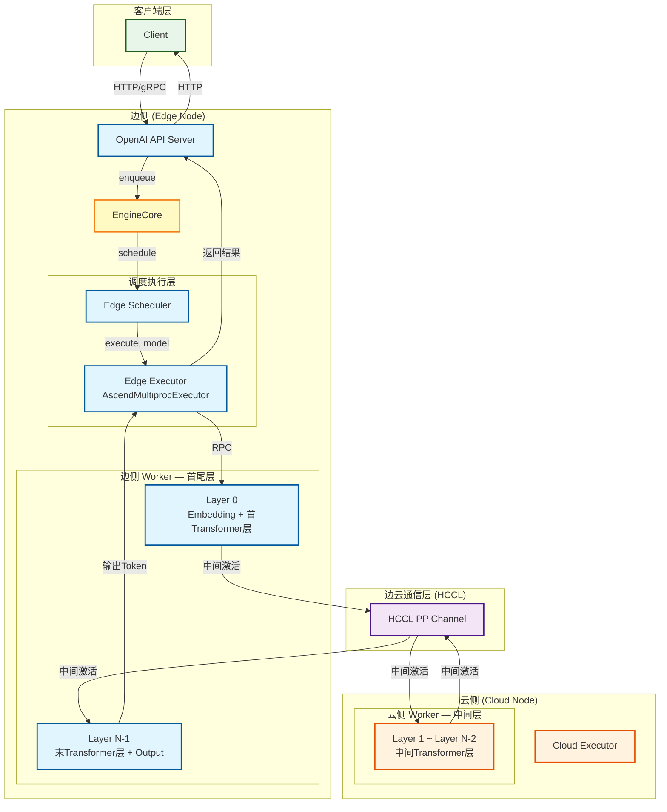

```mermaid
graph TB
    subgraph Client["客户端层"]
        C[Client]
    end

    subgraph Edge["边侧 (Edge Node)"]
        direction TB
        API[OpenAI API Server]
        EC[EngineCore]

        subgraph EdgeSchedExec["调度执行层"]
            SCHED[Edge Scheduler]
            EXEC[Edge Executor<br/>AscendMultiprocExecutor]
        end

        subgraph EdgeWorker["边侧 Worker — 首尾层"]
            L0[Layer 0<br/>Embedding + 首Transformer层]
            LN[Layer N-1<br/>末Transformer层 + Output]
        end
    end

    subgraph Cloud["云侧 (Cloud Node)"]
        direction TB
        CEXEC[Cloud Executor]

        subgraph CloudWorker["云侧 Worker — 中间层"]
            LM[Layer 1 ~ Layer N-2<br/>中间Transformer层]
        end
    end

    subgraph Comm["边云通信层 (HCCL)"]
        PP[HCCL PP Channel]
    end

    %% 请求流转
    C -->|HTTP/gRPC| API
    API -->|enqueue| EC
    EC -->|schedule| SCHED
    SCHED -->|execute_model| EXEC
    EXEC -->|RPC| L0

    L0 -->|中间激活| PP
    PP -->|中间激活| LM

    LM -->|中间激活| PP
    PP -->|中间激活| LN

    LN -->|输出Token| EXEC
    EXEC -->|返回结果| API
    API -->|HTTP| C

    %% 样式
    classDef edge fill:#e1f5fe,stroke:#01579b,stroke-width:2px
    classDef cloud fill:#fff3e0,stroke:#e65100,stroke-width:2px
    classDef comm fill:#f3e5f5,stroke:#4a148c,stroke-width:2px
    classDef client fill:#e8f5e9,stroke:#1b5e20,stroke-width:2px
    classDef core fill:#fff9c4,stroke:#f57f17,stroke-width:2px

    class API,SCHED,EXEC,L0,LN edge
    class CEXEC,LM cloud
    class PP comm
    class C client
    class EC core
```
