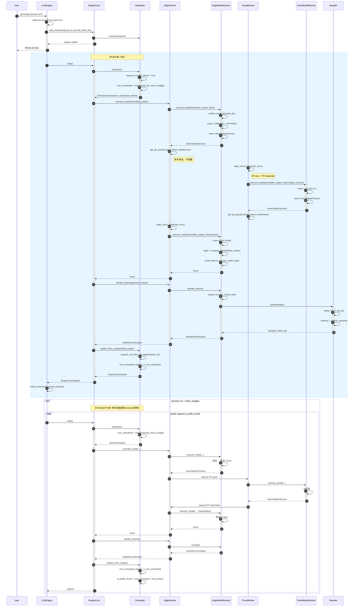
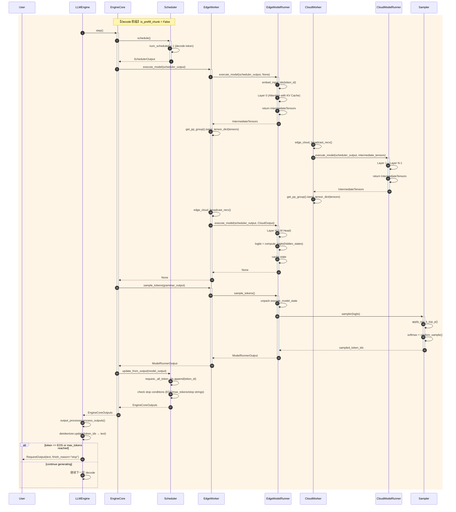
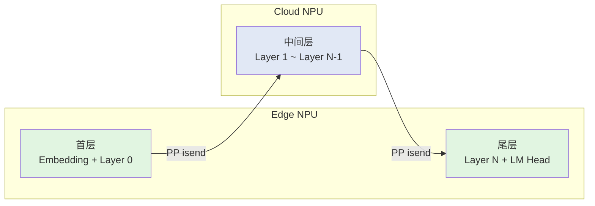
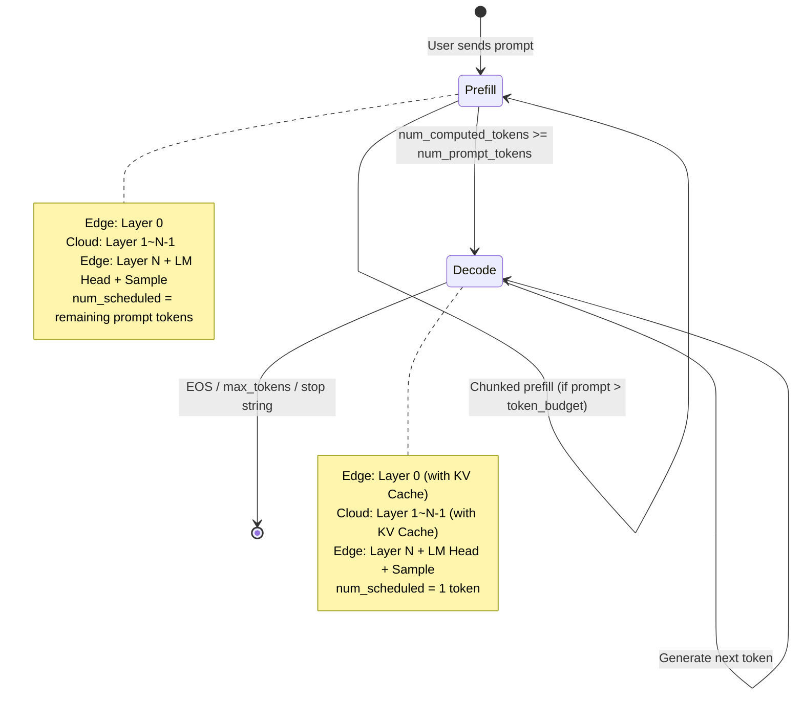

# vLLM-Ascend 边云协同 — 处理用户请求时序图

## 参与者说明

| 参与者 | 说明 |
|--------|------|
| User | 发送请求的用户 |
| LLMEngine | vLLM 前端引擎 |
| EngineCore | vLLM 核心调度与执行引擎 |
| Scheduler | 调度器，决定每轮计算哪些 token |
| EdgeWorker | Edge 侧 NPU Worker（跑首层+尾层） |
| EdgeModelRunner | Edge 侧模型执行器 |
| CloudWorker | Cloud 侧 NPU Worker（跑中间层） |
| CloudModelRunner | Cloud 侧模型执行器 |
| Sampler | 采样器，从 logits 生成 token |

---

## 1. Prefill 阶段（处理 Prompt，生成第 1 个 Token）

---

## 2. Decode 阶段（逐 Token 生成）

---

## 3. 关键数据流

---

## 4. 通信矩阵

| 通信方向 | 方法 | 通信域 | 数据内容 |
|---------|------|--------|---------|
| Edge NPU0 → Cloud NPU0 | `isend_tensor_dict()` | PP Group | IntermediateTensors (首层输出) |
| Cloud NPU0 → Cloud TP Ranks | `broadcast()` | TP Group | 首层输出广播到 Cloud 内所有 TP rank |
| Cloud NPU0 → Edge NPU0 | `isend_tensor_dict()` | PP Group | IntermediateTensors (中间层输出) |
| Edge NPU0 → Edge TP Ranks | `broadcast()` | TP Group | 中间层输出广播到 Edge 内所有 TP rank |

---

## 5. 状态转换

