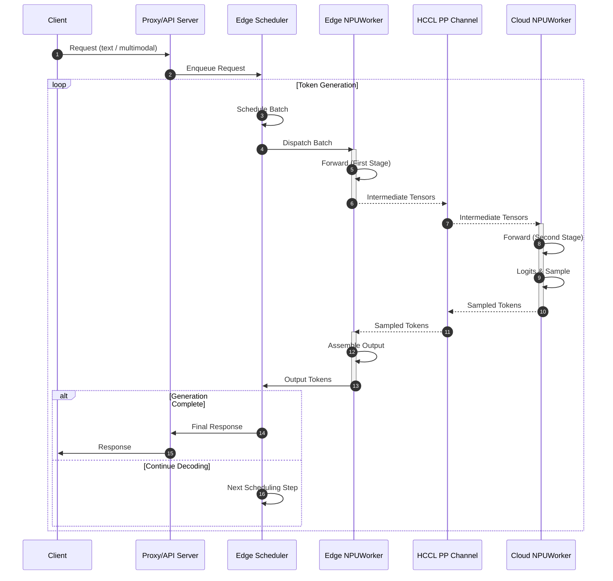

```mermaid
sequenceDiagram
    autonumber
    participant C as Client
    participant P as Proxy/API Server
    participant ES as Edge Scheduler
    participant EW as Edge NPUWorker
    participant HCCL as HCCL PP Channel
    participant CW as Cloud NPUWorker

    %% 请求接入
    C->>P: Request (text / multimodal)
    P->>ES: Enqueue Request

    %% 边侧调度 & 前向
    loop Token Generation
        ES->>ES: Schedule Batch
        ES->>EW: Dispatch Batch

        %% Edge Stage
        activate EW
        EW->>EW: Forward (First Stage)
        EW-->>HCCL: Intermediate Tensors
        deactivate EW

        %% Cloud Stage
        HCCL-->>CW: Intermediate Tensors
        activate CW
        CW->>CW: Forward (Second Stage)
        CW->>CW: Logits & Sample
        CW-->>HCCL: Sampled Tokens
        deactivate CW

        %% 结果回边
        HCCL-->>EW: Sampled Tokens
        activate EW
        EW->>EW: Assemble Output
        EW->>ES: Output Tokens
        deactivate EW

        alt Generation Complete
            ES->>P: Final Response
            P->>C: Response
        else Continue Decoding
            ES->>ES: Next Scheduling Step
        end
    end
```
