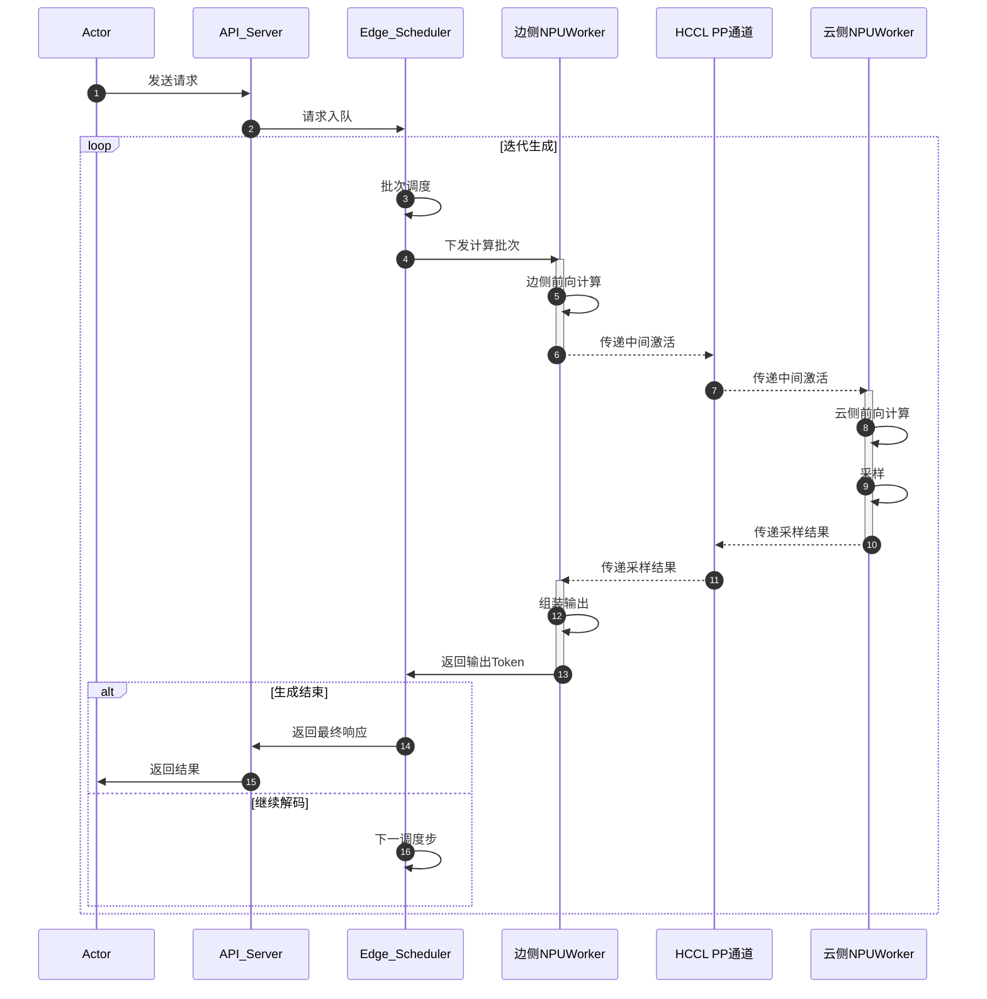

```mermaid
sequenceDiagram
    autonumber
    participant C as Actor
    participant P as API_Server
    participant ES as Edge_Scheduler
    participant EW as 边侧NPUWorker
    participant HCCL as HCCL PP通道
    participant CW as 云侧NPUWorker

    C->>P: 发送请求
    P->>ES: 请求入队

    loop 迭代生成
        ES->>ES: 批次调度
        ES->>EW: 下发计算批次

        activate EW
        EW->>EW: 边侧前向计算
        EW-->>HCCL: 传递中间激活
        deactivate EW

        HCCL-->>CW: 传递中间激活
        activate CW
        CW->>CW: 云侧前向计算
        CW->>CW: 采样
        CW-->>HCCL: 传递采样结果
        deactivate CW

        HCCL-->>EW: 传递采样结果
        activate EW
        EW->>EW: 组装输出
        EW->>ES: 返回输出Token
        deactivate EW

        alt 生成结束
            ES->>P: 返回最终响应
            P->>C: 返回结果
        else 继续解码
            ES->>ES: 下一调度步
        end
    end
```
