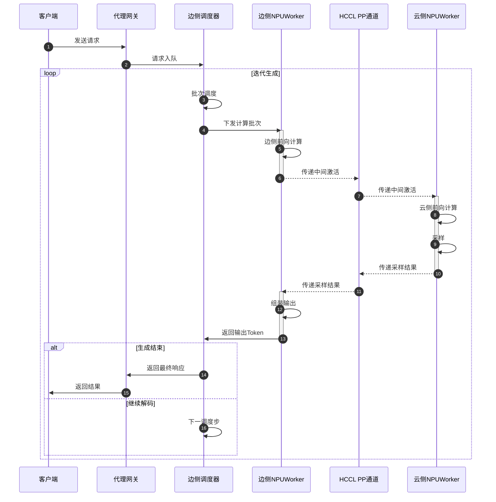

## 关键模块分解描述

| 模块 | 所属位置 | 核心职责 | 输入 | 输出 | 边云交互 |
|------|---------|---------|------|------|---------|
| 客户端 | 用户侧 | 发起推理请求，接收生成结果 | 用户指令/多模态数据 | 模型生成文本 | 仅与代理网关通信 |
| 代理网关 | 边侧入口 | 请求路由、负载均衡、协议转换 | HTTP/gRPC 请求 | 调度后的内部请求对象 | 将请求分发至边侧调度器；对外返回最终结果 |
| 边侧调度器 | 边侧进程 | 管理请求队列、构造计算批次、状态维护 | 待推理请求队列 | 调度好的批次描述（token 范围、位置编码等） | 向边侧NPUWorker下发批次；接收输出Token后判断生成是否结束 |
| 边侧NPUWorker | 边侧进程（NPU0） | 执行模型前半部分层计算（Embedding + 前若干Transformer层） | 输入Token/位置编码/注意力元数据 | 中间激活张量（IntermediateTensors） | 通过HCCL PP通道异步发送中间激活至云侧；接收云侧回传的采样结果 |
| HCCL PP通道 | 边云之间（NPU互联） | 承载PP阶段间的张量传输，包括中间激活和采样结果 | 中间激活张量 / 采样Token | 对端NPU接收到的张量 | 边侧NPU0 ↔ 云侧NPU0 的专用通信链路，底层由HCCL后端驱动 |
| 云侧NPUWorker | 云侧进程（NPU0） | 执行模型后半部分层计算（后若干Transformer层 + LM Head + 采样） | 来自边侧的中间激活张量 | 采样Token序列 | 通过HCCL PP通道接收中间激活；计算完成后广播采样结果回边侧 |
