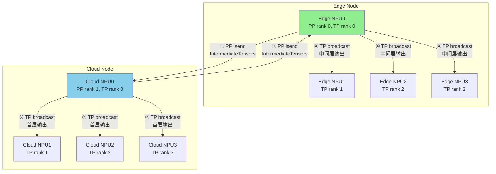

# vLLM-Ascend 边云协同 — 详细时序图（含关键函数）

## 图例说明

- 🔵 **蓝色背景**：Prefill 阶段（处理 prompt）
- 🟠 **橙色背景**：Decode 阶段（逐个生成 token）
- 🟢 **绿色箭头**：异步通信（不阻塞后续计算）
- 🔴 **红色箭头**：同步通信（阻塞等待）

---

## 完整时序图：从用户请求到生成 Token

```mermaid
sequenceDiagram
    autonumber
    participant U as User
    participant LE as LLMEngine<br/>(vllm/v1/engine/llm_engine.py)
    participant EC as EngineCore<br/>(vllm/v1/engine/core.py)
    participant S as Scheduler<br/>(vllm/v1/core/sched/scheduler.py)
    participant EW as EdgeWorker<br/>(vllm_ascend/worker/worker.py)
    participant EMR as EdgeModelRunner<br/>(vllm_ascend/worker/model_runner_v1.py)
    participant CW as CloudWorker<br/>(vllm_ascend/worker/worker.py)
    participant CMR as CloudModelRunner<br/>(vllm_ascend/worker/model_runner_v1.py)
    participant Sa as AscendSampler<br/>(vllm_ascend/sample/sampler.py)

    %% ============================================
    %% 第一阶段：用户请求入口 + Tokenization
    %% ============================================
    rect rgb(240, 240, 240)
        Note over U,LE: 【阶段 1：请求入口】
        
        U->>+LE: LLM.generate("prompt text")
        Note right of LE: llm.py:generate()<br/>用户入口 API
        
        LE->>LE: Renderer.render_cmpl()
        Note right of LE: renderers/base.py<br/>应用 chat template
        
        LE->>LE: tokenizer.encode("prompt text")
        Note right of LE: _tokenize_prompt()<br/>字符串 → token_ids [列表]
        
        LE->>+EC: engine.add_request(req_id, prompt_token_ids)
        Note right of EC: llm_engine.py:add_request()<br/>封装为 EngineCoreRequest
        
        EC->>S: InputProcessor.process_inputs()
        Note right of S: input_processor.py<br/>创建 Request 对象
        
        S->>S: scheduler.enqueue(request)
        Note right of S: 请求进入 WAITING 队列
        
        EC-->>-LE: request added
        LE-->>-U: 异步返回，等待生成
    end

    %% ============================================
    %% 第二阶段：Prefill 阶段（处理 Prompt）
    %% ============================================
    rect rgb(220, 235, 255)
        Note over EC,S: 【阶段 2：Prefill — 处理 Prompt，生成 KV Cache】<br/>request.is_prefill_chunk = True
        
        %% --- 调度 ---
        LE->>+EC: step()
        Note right of EC: core.py:step()<br/>每轮调度循环
        
        EC->>+S: schedule()
        Note right of S: scheduler.py:schedule()<br/>决定本轮计算哪些 token
        
        S->>S: num_new = num_tokens - num_computed_tokens
        Note right of S: 剩余 prompt token 数
        
        S->>S: num_new = min(num_new, token_budget)
        Note right of S: 受 token_budget 限制（chunked prefill）
        
        S->>S: KVCacheManager.allocate_slots()
        Note right of S: 分配 KV Cache 物理块
        
        S-->>-EC: SchedulerOutput(num_scheduled_tokens)
        Note right of EC: 包含每个请求的 token 数

        %% --- Edge 首层 Forward ---
        EC->>+EW: execute_model(scheduler_output)
        Note right of EW: worker.py:execute_model()<br/>Edge 入口
        
        EW->>EW: wait _pp_send_work
        Note right of EW: 等待上一轮 PP 发送完成
        
        EW->>+EMR: execute_model(scheduler_output, None)
        Note right of EMR: model_runner_v1.py:execute_model()<br/>intermediate_tensors=None<br/>表示跑首层
        
        EMR->>EMR: _prepare_inputs()
        Note right of EMR: index_select gather token_ids<br/>CPU → NPU 拷贝
        
        EMR->>EMR: embed_input_ids(input_ids)
        Note right of EMR: llama.py:embed_input_ids()<br/>F.embedding() → embeddings
        
        EMR->>EMR: set_ascend_forward_context()
        Note right of EMR: ascend_forward_context.py<br/>设置 MC2 mask、attention state
        
        EMR->>EMR: _model_forward()
        Note right of EMR: model_runner_v1.py:_model_forward()<br/>调用 self.model(...)
        
        EMR->>EMR: Layer 0 (Attention + MLP/MoE)
        Note right of EMR: npu_fused_infer_attention_score()<br/>Ascend 原生融合 Attention
        
        EMR->>EMR: is_edge_cloud_pp_mode() and intermediate_tensors is None
        Note right of EMR: 条件成立 → 首层算完<br/>return IntermediateTensors
        
        EMR-->>-EW: IntermediateTensors<br/>{hidden_states, residual}

        %% --- Edge → Cloud 发送 ---
        EW->>EW: get_pp_group().isend_tensor_dict(output.tensors)
        Note right of EW: worker.py:392<br/>🔴 PP 异步发送给 Cloud NPU0<br/>不阻塞，句柄存 _pp_send_work

        %% --- Cloud 接收 + 中间层 ---
        CW->>CW: edge_cloud_broadcast_recv()
        Note right of CW: parallel_state.py:340<br/>🔵 PP recv + TP broadcast<br/>Cloud NPU0 先 recv，再 TP broadcast 给 Cloud 其他 rank
        
        CW->>+CMR: execute_model(scheduler_output, intermediate_tensors)
        Note right of CMR: Cloud 跑中间层 Layer 1~N-1
        
        CMR->>CMR: _model_forward()
        CMR->>CMR: Layer 1 ~ Layer N-1
        Note right of CMR: 每层: Attention → MLP/MoE
        
        CMR->>CMR: return IntermediateTensors
        CMR-->>-CW: IntermediateTensors

        %% --- Cloud → Edge 发送 ---
        CW->>CW: get_pp_group().isend_tensor_dict(output.tensors)
        Note right of CW: worker.py:507<br/>🔴 PP 异步发送回 Edge NPU0

        %% --- Edge 接收 + 尾层 ---
        EW->>EW: edge_cloud_broadcast_recv()
        Note right of EW: worker.py:479<br/>🔵 接收 Cloud 中间层结果
        
        EW->>+EMR: execute_model(scheduler_output, CloudOutput)
        Note right of EMR: intermediate_tensors=CloudOutput<br/>跑尾层 Layer N + LM Head
        
        EMR->>EMR: _model_forward()
        EMR->>EMR: Layer N (Final Layer)
        
        EMR->>EMR: get_pp_group().is_last_rank = True
        Note right of EMR: 是 last rank → 不返回 IntermediateTensors
        
        EMR->>EMR: sample_hidden = hidden_states[logits_indices]
        Note right of EMR: model_runner_v1.py:1419<br/>取出需要采样的位置
        
        EMR->>EMR: logits = model.compute_logits(sample_hidden)
        Note right of EMR: model_runner_v1.py:1421<br/>LM Head 计算 logits
        
        EMR->>EMR: execute_model_state = ExecuteModelState(logits, ...)
        Note right of EMR: model_runner_v1.py:1443<br/>缓存状态，execute_model 返回 None
        
        EMR-->>-EW: None
        EW-->>-EC: None
        Note right of EC: execute_model 返回 None<br/>表示采样在外部做

        %% --- 采样 ---
        EC->>+EW: sample_tokens(grammar_output)
        Note right of EW: worker.py:538<br/>触发采样
        
        EW->>+EMR: sample_tokens()
        Note right of EMR: model_runner_v1.py:1461
        
        EMR->>EMR: unpack execute_model_state
        Note right of EMR: 取出之前缓存的 logits
        
        EMR->>+Sa: sampler(logits, sampling_metadata)
        Note right of Sa: sampler.py:forward()<br/>apply_logits_processors()<br/>temperature, top_k, top_p, repetition_penalty
        
        Sa->>Sa: apply_top_k_top_p()
        Note right of Sa: topk_topp_sampler.py<br/>过滤 logits
        
        Sa->>Sa: softmax + random_sample()
        Note right of Sa: 多项式采样得到 token_id
        
        Sa-->>-EMR: SamplerOutput(sampled_token_ids)
        EMR->>EMR: build ModelRunnerOutput
        EMR-->>-EW: ModelRunnerOutput
        EW-->>-EC: ModelRunnerOutput

        %% --- 更新状态 ---
        EC->>S: update_from_output(model_output)
        Note right of S: scheduler.py:update_from_output()<br/>把 token 写回请求
        
        S->>S: request._all_token_ids.append(token_id)
        Note right of S: 生成的新 token 加入序列
        
        S->>S: num_computed_tokens += num_scheduled
        Note right of S: 更新已计算 token 数
        
        S->>S: is_prefill_chunk = num_computed < num_tokens
        Note right of S: 判断 prompt 是否算完
        
        S-->>EC: EngineCoreOutputs
        EC-->>-LE: EngineCoreOutputs
        
        LE->>LE: OutputProcessor.process_outputs()
        Note right of LE: output_processor.py<br/>detokenizer: token_ids → text
        
        alt prompt 还有剩余（chunked prefill）
            LE->>EC: 继续下一轮 prefill
            Note over EC,S: 回到步骤 2，继续 chunked prefill
        else prompt 已全部算完
            Note over EC,S: 【Prefill 完成】→ 进入 Decode
        end
    end

    %% ============================================
    %% 第三阶段：Decode 阶段（逐 Token 生成）
    %% ============================================
    rect rgb(255, 235, 210)
        Note over EC,S: 【阶段 3：Decode — 逐个生成 Token】<br/>request.is_prefill_chunk = False，num_scheduled = 1
        
        loop 直到生成 EOS 或 max_tokens
            LE->>+EC: step()
            
            EC->>+S: schedule()
            S->>S: num_scheduled = 1
            Note right of S: Decode 每轮只算 1 个 token
            S->>S: KVCacheManager.allocate_slots()
            S-->>-EC: SchedulerOutput
            
            %% --- Edge 首层（带 KV Cache）---
            EC->>+EW: execute_model(scheduler_output)
            
            EW->>+EMR: execute_model(scheduler_output, None)
            EMR->>EMR: _prepare_inputs()
            Note right of EMR: index_select gather<br/>上次生成的 token_id
            
            EMR->>EMR: embed_input_ids(token_id)
            Note right of EMR: 只 embed 1 个 token
            
            EMR->>EMR: _model_forward()
            EMR->>EMR: Layer 0 (Attention with KV Cache)
            Note right of EMR: 使用之前存的 KV Cache<br/>npu_fused_infer_attention_score()
            
            EMR->>EMR: return IntermediateTensors
            EMR-->>-EW: IntermediateTensors
            
            EW->>EW: get_pp_group().isend_tensor_dict(tensors)
            Note right of EW: 🔴 异步发送给 Cloud
            
            %% --- Cloud 中间层 ---
            CW->>CW: edge_cloud_broadcast_recv()
            CW->>+CMR: execute_model(scheduler_output, intermediate_tensors)
            CMR->>CMR: Layer 1 ~ Layer N-1 (with KV Cache)
            CMR-->>-CW: IntermediateTensors
            
            CW->>CW: get_pp_group().isend_tensor_dict(tensors)
            Note right of CW: 🔴 异步发送回 Edge
            
            %% --- Edge 尾层 + 采样 ---
            EW->>EW: edge_cloud_broadcast_recv()
            EW->>+EMR: execute_model(scheduler_output, CloudOutput)
            EMR->>EMR: Layer N (LM Head)
            EMR->>EMR: logits = compute_logits(hidden_states)
            EMR->>EMR: cache state
            EMR-->>-EW: None
            EW-->>-EC: None
            
            EC->>+EW: sample_tokens(grammar_output)
            EW->>+EMR: sample_tokens()
            EMR->>EMR: unpack execute_model_state
            EMR->>+Sa: sampler(logits)
            Sa->>Sa: top_k + top_p + softmax + sample
            Sa-->>-EMR: sampled_token_ids
            EMR-->>-EW: ModelRunnerOutput
            EW-->>-EC: ModelRunnerOutput
            
            EC->>S: update_from_output()
            S->>S: append token, check stop
            
            alt token == EOS
                S->>S: finish_reason = "stop"
            else token == max_tokens
                S->>S: finish_reason = "length"
            end
            
            S-->>EC: EngineCoreOutputs
            EC-->>-LE: EngineCoreOutputs
            
            LE->>LE: process_outputs() → detokenize
        end
        
        LE-->>U: RequestOutput(text, finish_reason)
        Note right of LE: 返回最终生成结果给用户
    end
```



---

## 关键函数速查表

| 阶段 | 文件 | 函数 | 作用 |
|------|------|------|------|
| **请求入口** | `vllm/entrypoints/llm.py` | `LLM.generate()` | 用户 API |
| | `vllm/renderers/base.py` | `_tokenize_prompt()` | `tokenizer.encode()` |
| | `vllm/v1/engine/input_processor.py` | `process_inputs()` | 创建 Request |
| **调度** | `vllm/v1/core/sched/scheduler.py` | `schedule()` | 决定每轮 token 数 |
| | `vllm/v1/core/sched/scheduler.py` | `_update_after_schedule()` | 更新 `is_prefill_chunk` |
| **Edge 首层** | `vllm_ascend/worker/worker.py` | `NPUWorker.execute_model()` | Edge Worker 入口 |
| | `vllm_ascend/worker/model_runner_v1.py` | `NPUModelRunner.execute_model()` | 模型执行 |
| | `vllm_ascend/worker/model_runner_v1.py` | `_prepare_inputs()` | 准备 input_ids |
| | `vllm/model_executor/models/llama.py` | `embed_input_ids()` | Embedding |
| | `vllm_ascend/worker/model_runner_v1.py` | `_model_forward()` | 模型 forward |
| | `vllm_ascend/attention/attention_v1.py` | `npu_fused_infer_attention_score()` | Attention |
| **Edge→Cloud** | `vllm_ascend/worker/worker.py` | `isend_tensor_dict()` | PP 异步发送 |
| **Cloud 接收** | `vllm_ascend/distributed/parallel_state.py` | `edge_cloud_broadcast_recv()` | PP recv + TP broadcast |
| **Cloud 中间层** | `vllm_ascend/worker/worker.py` | `NPUWorker.execute_model()` | Cloud Worker 入口 |
| | `vllm_ascend/worker/model_runner_v1.py` | `_model_forward()` | 中间层 forward |
| **Cloud→Edge** | `vllm_ascend/worker/worker.py` | `isend_tensor_dict()` | PP 异步发送 |
| **Edge 尾层** | `vllm_ascend/worker/model_runner_v1.py` | `compute_logits()` | LM Head |
| **采样** | `vllm/v1/engine/core.py` | `sample_tokens()` | 触发采样 |
| | `vllm_ascend/worker/model_runner_v1.py` | `sample_tokens()` | 取出缓存 logits |
| | `vllm_ascend/sample/sampler.py` | `AscendSampler.forward()` | 采样逻辑 |
| | `vllm_ascend/sample/sampler.py` | `apply_top_k_top_p()` | 过滤 logits |
| **状态更新** | `vllm/v1/core/sched/scheduler.py` | `update_from_output()` | 写回 token |
| **输出** | `vllm/v1/engine/output_processor.py` | `process_outputs()` | detokenize |

---

## 通信流程简图



---

## 数据流向（每轮 Step）

```
┌─────────────────────────────────────────────────────────────────────┐
│                         Edge NPU (首层)                              │
│  input_ids ──► Embedding ──► Layer 0 ──► IntermediateTensors        │
│                              (Attention + MLP/MoE)                  │
└───────────────────────────────┬─────────────────────────────────────┘
                                │ PP isend (异步)
                                ▼
┌─────────────────────────────────────────────────────────────────────┐
│                        Cloud NPU (中间层)                            │
│  IntermediateTensors ──► Layer 1~N-1 ──► IntermediateTensors        │
│                              (Attention + MLP/MoE)                  │
└───────────────────────────────┬─────────────────────────────────────┘
                                │ PP isend (异步)
                                ▼
┌─────────────────────────────────────────────────────────────────────┐
│                         Edge NPU (尾层)                              │
│  IntermediateTensors ──► Layer N ──► hidden_states                  │
│                              (LM Head)                              │
│  hidden_states[logits_indices] ──► compute_logits() ──► logits      │
│  logits ──► Sampler ──► sampled_token_ids                            │
└─────────────────────────────────────────────────────────────────────┘
```
