# 边云协同系统下普通请求处理流程（含函数与注释）

> 普通请求 = 纯文本输入，走标准 vLLM v1 调度与执行链路

---

## 一、总体流程图

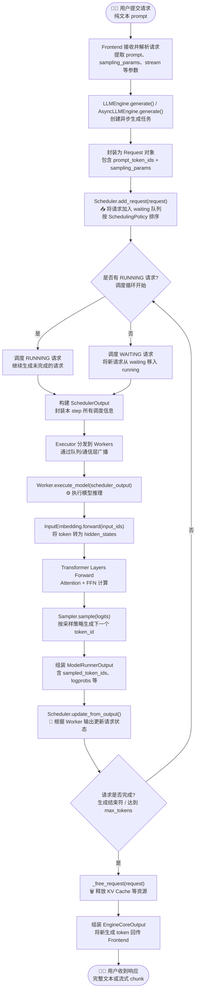

---

## 二、Phase 1：请求接收与入队

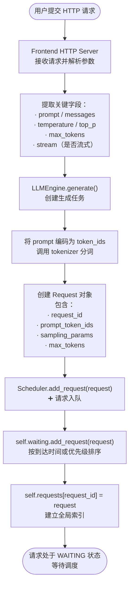

**关键函数**：`vllm/v1/core/sched/scheduler.py::add_request()`

```python
def add_request(self, request: Request) -> None:
    # 将请求加入等待队列，按 SchedulingPolicy 排序
    self.waiting.add_request(request)
    # 建立 request_id 到 Request 对象的映射
    self.requests[request.request_id] = request
    if self.log_stats:
        request.record_event(EngineCoreEventType.QUEUED)
```

---

## 三、Phase 2：调度器主循环

### 3.1 schedule() 主入口

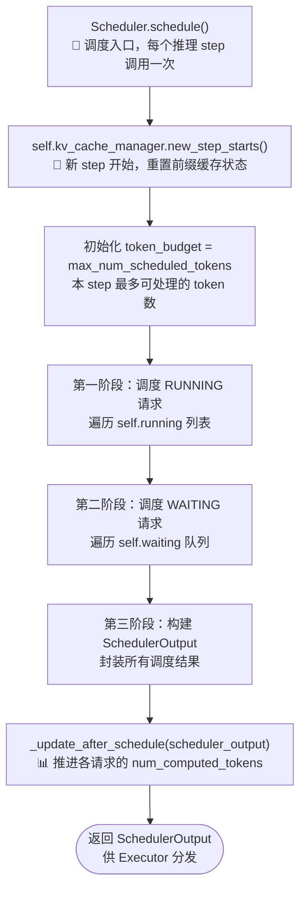

**关键函数**：`vllm/v1/core/sched/scheduler.py::schedule()`

```python
def schedule(self) -> SchedulerOutput:
    # 新 step 开始
    self.kv_cache_manager.new_step_starts()
    token_budget = self.max_num_scheduled_tokens
    
    # 1) 调度 RUNNING 请求（继续生成）
    for req in self.running:
        num_new_tokens = min(
            req.num_tokens - req.num_computed_tokens,
            token_budget
        )
        # 分配 KV Cache Blocks...
        token_budget -= num_new_tokens
    
    # 2) 调度 WAITING 请求（新请求）
    while self.waiting and token_budget > 0:
        req = self.waiting.peek_request()
        # 分配 KV Cache Blocks...
        self.running.append(req)
    
    # 3) 构建输出
    scheduler_output = SchedulerOutput(...)
    self._update_after_schedule(scheduler_output)
    return scheduler_output
```

---

### 3.2 RUNNING 请求调度

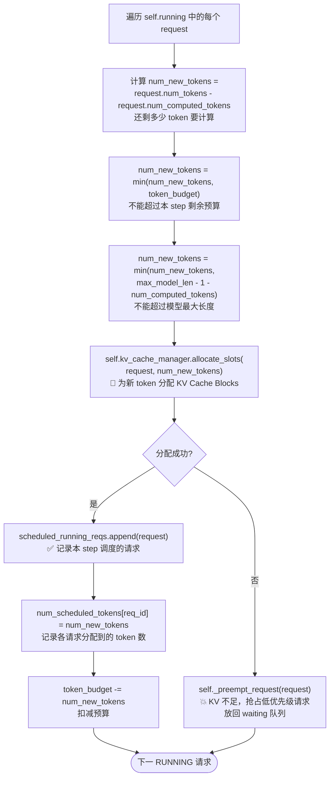

**关键函数**：`vllm/v1/core/sched/scheduler.py::schedule()` 第一段循环

---

### 3.3 WAITING 请求调度

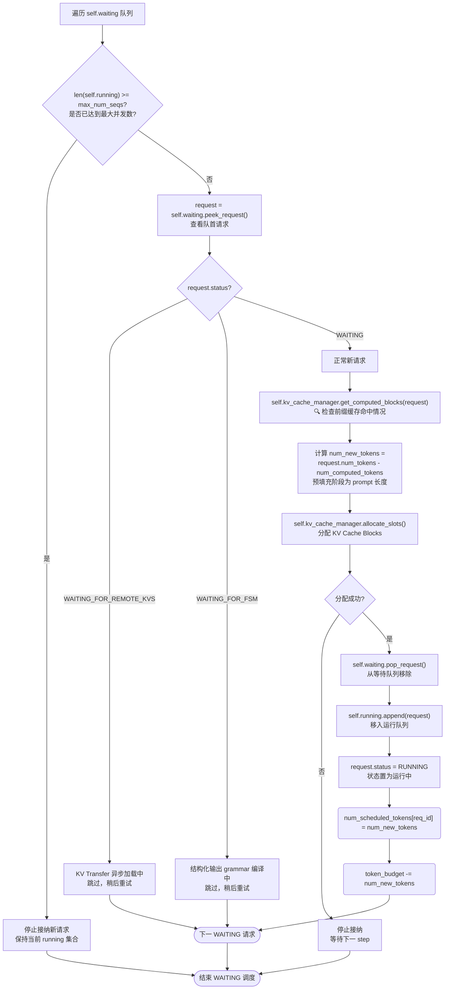

**关键函数**：`vllm/v1/core/sched/scheduler.py::schedule()` 第二段循环

---

### 3.4 调度后更新

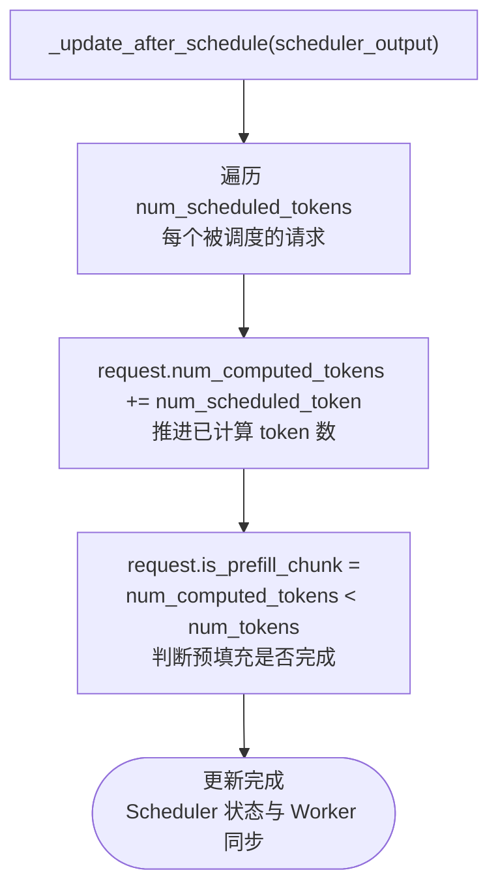

**关键函数**：`vllm/v1/core/sched/scheduler.py::_update_after_schedule()`

```python
def _update_after_schedule(self, scheduler_output: SchedulerOutput) -> None:
    for req_id, num_scheduled_token in scheduler_output.num_scheduled_tokens.items():
        request = self.requests[req_id]
        request.num_computed_tokens += num_scheduled_token
        request.is_prefill_chunk = request.num_computed_tokens < request.num_tokens
```

---

## 四、Phase 3：Worker 执行推理

### 4.1 Executor 分发

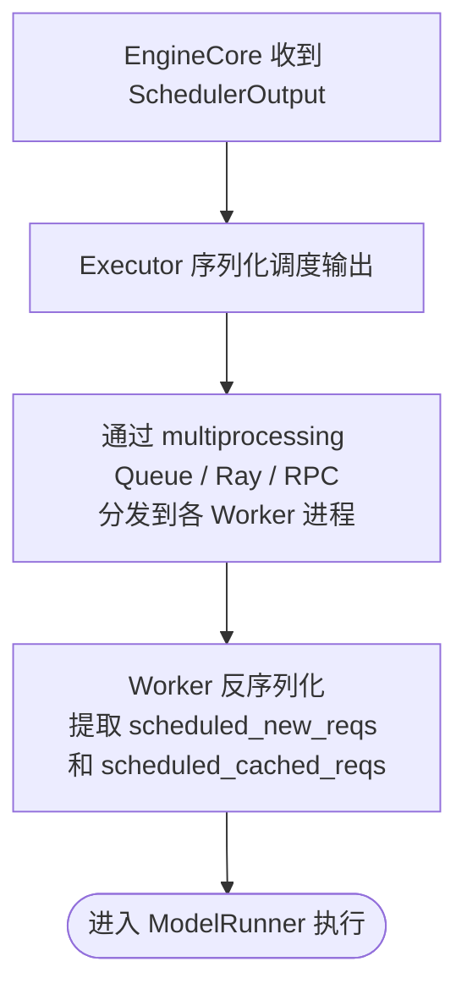

**关键函数**：`vllm/v1/executor/multiproc_executor.py` 或 `vllm/v1/executor/ray_executor.py`

---

### 4.2 ModelRunner 执行模型

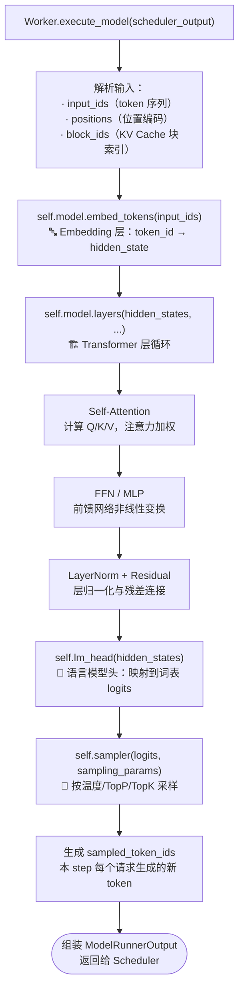

**关键函数**：`vllm/v1/worker/gpu_model_runner.py::execute_model()`

---

### 4.3 纯文本请求在 ModelRunner 中的数据流

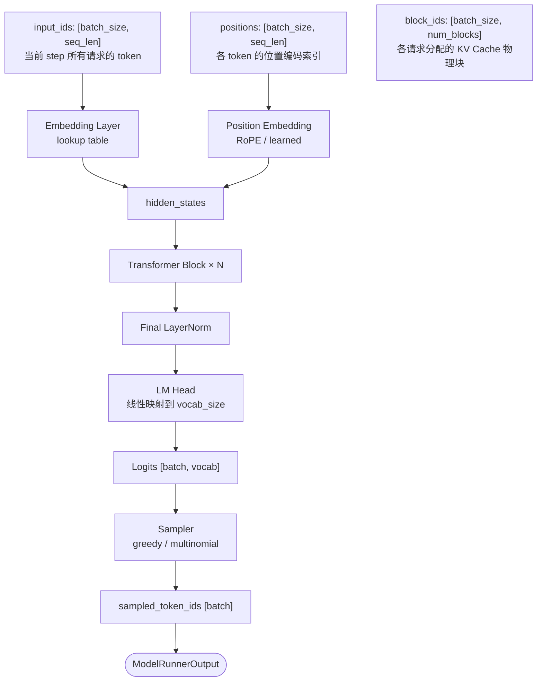

---

## 五、Phase 4：状态更新与结果回传

### 5.1 Scheduler 更新输出

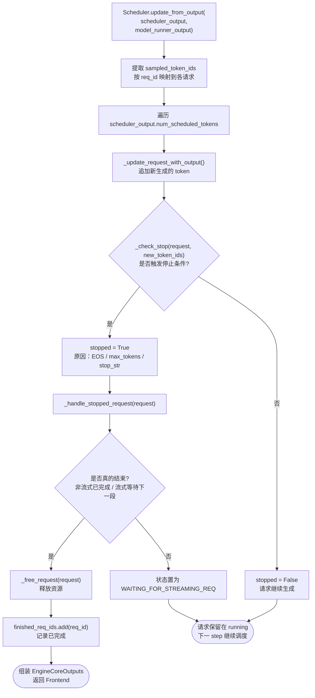

**关键函数**：`vllm/v1/core/sched/scheduler.py::update_from_output()`

```python
def update_from_output(self, scheduler_output, model_runner_output):
    for req_id, num_tokens in scheduler_output.num_scheduled_tokens.items():
        request = self.requests[req_id]
        req_index = model_runner_output.req_id_to_index[req_id]
        generated = model_runner_output.sampled_token_ids[req_index]
        
        # 更新请求状态
        new_tokens, stopped = self._update_request_with_output(request, generated)
        
        if stopped:
            finished = self._handle_stopped_request(request)
            if finished:
                self._free_request(request)
                self.finished_req_ids.add(req_id)
```

---

### 5.2 资源释放

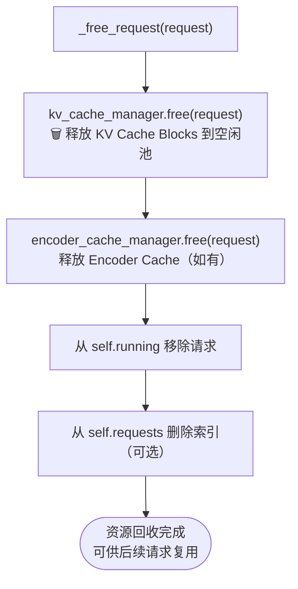

**关键函数**：`vllm/v1/core/sched/scheduler.py::_free_request()`

---

### 5.3 结果返回用户

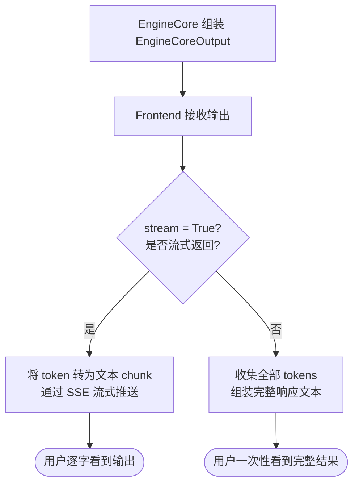

---

## 六、普通请求完整时序图

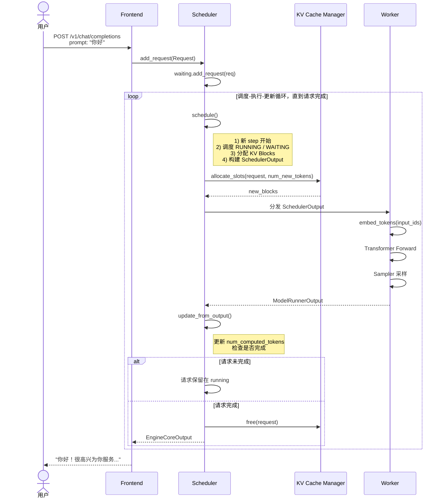

---

## 七、关键函数速查表

| 阶段 | 函数 | 位置 | 职责 |
|------|------|------|------|
| 接收 | `Frontend.receive_request()` | `vllm/entrypoints/` | HTTP 请求解析 |
| 入队 | `Scheduler.add_request()` | `vllm/v1/core/sched/scheduler.py` | 请求加入 waiting 队列 |
| 调度 | `Scheduler.schedule()` | `vllm/v1/core/sched/scheduler.py` | 主调度循环 |
| 分配 | `KVCacheManager.allocate_slots()` | `vllm/v1/core/kv_cache_manager.py` | KV Block 分配 |
| 更新 | `Scheduler._update_after_schedule()` | `vllm/v1/core/sched/scheduler.py` | 推进 computed tokens |
| 执行 | `Worker.execute_model()` | `vllm/v1/worker/gpu_worker.py` | Worker 执行入口 |
| 推理 | `GPUModelRunner.execute_model()` | `vllm/v1/worker/gpu_model_runner.py` | 模型前向 + 采样 |
| Embedding | `VocabParallelEmbedding.forward()` | `vllm/model_executor/layers/` | token 转 hidden |
| 采样 | `Sampler.forward()` | `vllm/v1/sample/sampler.py` | logits 转 token |
| 更新 | `Scheduler.update_from_output()` | `vllm/v1/core/sched/scheduler.py` | 根据输出更新状态 |
| 释放 | `Scheduler._free_request()` | `vllm/v1/core/sched/scheduler.py` | 释放 KV Cache |
| 返回 | `Frontend.stream_response()` | `vllm/entrypoints/` | 结果回传用户 |

---

## 八、vllm-ascend 扩展点（普通请求同样生效）

| 扩展 | 生效函数 | 对普通请求的影响 |
|------|---------|---------------|
| 动态批处理 | `SchedulerDynamicBatch.schedule()` | 通过 `BudgetRefiner` 动态调整 token budget，decode-first 重排队列 |
| 重计算调度 | `RecomputeScheduler.schedule()` | P/D 分离时 KV 不足则将请求回退到 PD Proxy，普通请求同样受保护 |
| 负载均衡 | `BalanceScheduler.balance_gather()` | DP 场景下防止单 rank 过载，影响新请求接纳 |
| NPU 适配 | `NPUModelRunner.execute_model()` | 将 CUDA 算子替换为 NPU 算子，逻辑流程不变 |
