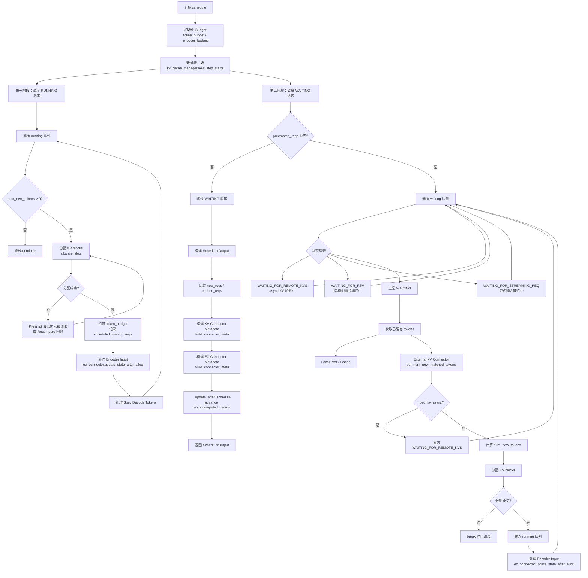
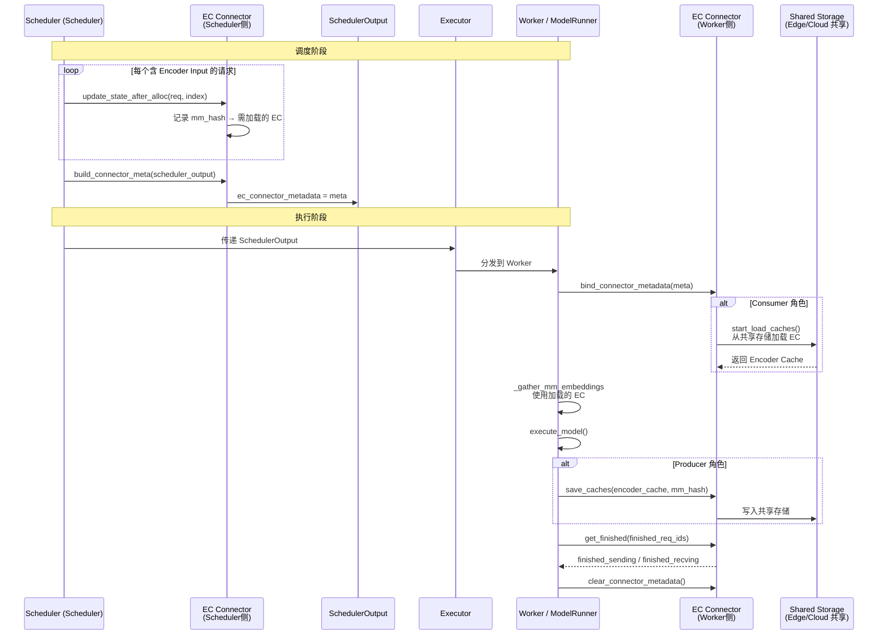
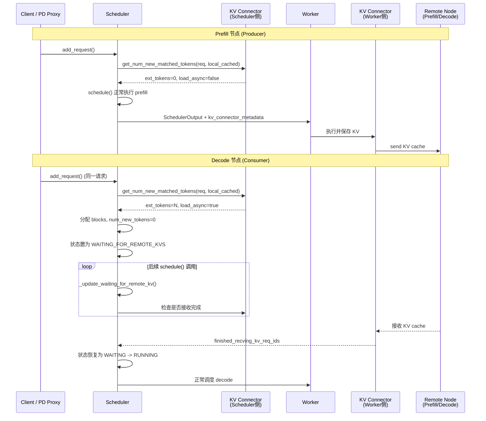

# 边云协同场景下请求调度的总体结构与逻辑视图

> 基于 vLLM v1 + vllm-ascend 修改的调度架构梳理  
> 覆盖：标准调度器、动态批处理、重计算调度、负载均衡、边云协同（EC Transfer）、KV Transfer（P/D 分离）

---

## 一、总体结构视图

### 1.1 调度器类层次结构

```
┌─────────────────────────────────────────────────────────────┐
│                    vLLM v1 Core Scheduler                   │
│                    (sched/scheduler.py)                     │
│  - schedule() 主调度循环                                      │
│  - KV Cache 管理 / Prefix Caching                            │
│  - KV Connector 集成 (P/D 分离 / Offloading)                 │
│  - EC Connector 集成 (边云 Encoder Cache 协同)                │
└─────────────────────────────────────────────────────────────┘
                              ▲
          ┌───────────────────┼───────────────────┐
          │                   │                   │
          ▼                   ▼                   ▼
┌─────────────────┐ ┌─────────────────┐ ┌─────────────────────┐
│ SchedulerDynamic│ │ RecomputeScheduler│ │ BalanceScheduler   │
│     Batch       │ │  (vllm-ascend)  │ │   (vllm-ascend)    │
│ (vllm-ascend)   │ │                 │ │                    │
│                 │ │ - recomputed_reqs│ │ - balance_gather   │
│ - BudgetRefiner │ │   回退到 PD Proxy │ │   (DP 负载均衡)     │
│   动态调整预算   │ │ - MTP placeholder│ │ - 防止单 rank 过载  │
│ - Decode-first  │ │ - Hybrid model   │ │                    │
│   chunked       │ │   特殊处理        │ └─────────────────────┘
│   prefills      │ │                 │
└─────────────────┘ └─────────────────┘
          │                   │
          └───────────────────┘
                      ▲
                      │
           ┌──────────┘
           ▼
┌─────────────────────────────┐
│   AsyncRecomputeScheduler   │
│   (多重继承 Async +         │
│            Recompute)       │
└─────────────────────────────┘
```

### 1.2 边云协同 & KV 分离 全局架构

```
┌─────────────────────────────────────────────────────────────────────────────┐
│                              边云协同 总体架构                                │
├─────────────────────────────────────────────────────────────────────────────┤
│                                                                             │
│   ┌──────────────┐         ┌──────────────┐         ┌──────────────┐       │
│   │   Edge 端    │         │   网络层     │         │   Cloud 端   │       │
│   │  (Producer)  │◄───────►│  (P2P/网络)  │◄───────►│  (Consumer)  │       │
│   └──────┬───────┘         └──────────────┘         └──────┬───────┘       │
│          │                                                  │               │
│          ▼                                                  ▼               │
│   ┌──────────────┐                                  ┌──────────────┐       │
│   │ EC Connector │                                  │ EC Connector │       │
│   │  save_caches │                                  │start_load_   │       │
│   │  (Encoder    │                                  │  caches      │       │
│   │   Cache 产出) │                                  │(Encoder Cache│       │
│   └──────────────┘                                  │   消费)      │       │
│                                                     └──────────────┘       │
│                                                                             │
│   ┌─────────────────────────────────────────────────────────────────┐      │
│   │                     vLLM Engine Core (每实例)                    │      │
│   │  ┌─────────────┐    ┌─────────────┐    ┌─────────────────────┐  │      │
│   │  │  Scheduler  │───►│  Scheduler  │───►│   SchedulerOutput   │  │      │
│   │  │  (调度决策)  │    │  Output     │    │  + kv_connector_    │  │      │
│   │  │             │    │  (输出封装)  │    │    metadata         │  │      │
│   │  │ · waiting   │    │             │    │  + ec_connector_    │  │      │
│   │  │ · running   │    │             │    │    metadata         │  │      │
│   │  │ · preempt   │    │             │    │                     │  │      │
│   │  └─────────────┘    └─────────────┘    └─────────────────────┘  │      │
│   │           │                              │                      │      │
│   │           ▼                              ▼                      │      │
│   │  ┌─────────────────────────────────────────────────────────┐   │      │
│   │  │              Executor (multiproc / ray)                 │   │      │
│   │  │  ┌─────────────┐    ┌─────────────┐    ┌─────────────┐ │   │      │
│   │  │  │   Worker 0  │    │   Worker 1  │... │   Worker N  │ │   │      │
│   │  │  │ · ModelRunner│    │ · ModelRunner│    │ · ModelRunner│ │   │      │
│   │  │  │ · KV Conn   │    │ · KV Conn   │    │ · KV Conn   │ │   │      │
│   │  │  │ · EC Conn   │    │ · EC Conn   │    │ · EC Conn   │ │   │      │
│   │  │  └─────────────┘    └─────────────┘    └─────────────┘ │   │      │
│   │  └─────────────────────────────────────────────────────────┘   │      │
│   └─────────────────────────────────────────────────────────────────┘      │
│                                                                             │
└─────────────────────────────────────────────────────────────────────────────┘
```

### 1.3 核心组件职责表

| 组件 | 文件位置 | 职责说明 |
|------|---------|---------|
| `Scheduler` | `vllm/v1/core/sched/scheduler.py` | vLLM v1 标准调度器，管理 waiting/running 队列，分配 KV blocks，集成 KV/EC Connector |
| `SchedulerDynamicBatch` | `vllm_ascend/core/scheduler_dynamic_batch.py` | 继承 Scheduler，增加 `BudgetRefiner` 动态调整 token budget，采用 decode-first 策略 |
| `RecomputeScheduler` | `vllm_ascend/core/recompute_scheduler.py` | 继承 Scheduler，在 KV Consumer 内存不足时通过 `recomputed_reqs` 将请求回退到 PD Proxy，支持 MTP 和 Hybrid Model |
| `BalanceScheduler` | `vllm_ascend/patch/platform/patch_balance_schedule.py` | 继承 Scheduler，DP 场景下通过 `balance_gather` 实现跨 rank 负载均衡 |
| `AsyncScheduler` | `vllm/v1/core/sched/async_scheduler.py` | 增加 async scheduling 支持（spec decode placeholder、output placeholder 管理） |
| `ECConnectorBase` | `vllm/distributed/ec_transfer/ec_connector/base.py` | 边云 Encoder Cache 连接器抽象基类，定义 Scheduler 侧和 Worker 侧接口 |
| `ECExampleConnector` | `vllm/distributed/ec_transfer/ec_connector/example_connector.py` | 基于共享存储（如磁盘/NFS）的 EC Connector 参考实现 |
| `ECConnectorModelRunnerMixin` | `vllm/v1/worker/ec_connector_model_runner_mixin.py` | ModelRunner 中的 EC 功能混入，封装 `load/save/get_finished` 生命周期 |
| `KVConnector` | `vllm/distributed/kv_transfer/...` | KV Cache 传输连接器，支持 P/D 分离、remote prefill/decode、offloading |

---

## 二、逻辑视图

### 2.1 调度主流程（schedule() 逻辑）



### 2.2 请求状态转换机

```
                    ┌─────────────────┐
                    │     外部输入     │
                    │  add_request()  │
                    └────────┬────────┘
                             ▼
                    ┌─────────────────┐
                    │     WAITING     │
                    │  (等待调度)      │
                    └────────┬────────┘
                             │ schedule() 选中
                             ▼
              ┌──────────────────────────────┐
              │         RUNNING              │
              │    (正在执行计算)             │
              │  · prefill chunk             │
              │  · decode                    │
              └─────────────┬────────────────┘
                            │
              ┌─────────────┼─────────────┐
              ▼             ▼             ▼
       ┌──────────┐  ┌──────────┐  ┌──────────┐
       │ FINISHED │  │ PREEMPTED│  │ WAITING_ │
       │(正常完成) │  │(被抢占)  │  │FOR_REMOTE│
       │          │  │          │  │  _KVS    │
       └──────────┘  └────┬─────┘  │(KV异步载)│
                          │        └────┬─────┘
                          │ prepend     │ 加载完成
                          │ 回 waiting  ▼
                          └────────► WAITING
                            (num_computed=0)
```

**关键状态说明（vllm-ascend 扩展）**：

| 状态 | 说明 | 触发条件 |
|------|------|---------|
| `WAITING` | 正常等待调度 | 新请求加入或被抢占后恢复 |
| `RUNNING` | 正在执行 | 被 schedule() 选中并分配 KV blocks |
| `PREEMPTED` | 被抢占 | KV 不足时抢占低优先级请求 |
| `WAITING_FOR_REMOTE_KVS` | 等待远程 KV | KV Connector async load 中 |
| `WAITING_FOR_FSM` | 等待结构化输出编译 | 结构化输出请求 grammar 编译中 |
| `WAITING_FOR_STREAMING_REQ` | 等待流式下一段 | 流式输入等待下一段数据 |

### 2.3 边云协同（EC Transfer）数据流



### 2.4 KV Transfer（P/D 分离）在调度中的集成



---

## 三、vllm-ascend 关键修改详解

### 3.1 动态批处理（SchedulerDynamicBatch）

```python
class SchedulerDynamicBatch(Scheduler):
    # 核心修改点：
    # 1. BudgetRefiner 基于 profile_table.csv 查找表，
    #    根据当前 decode 请求数和平均 ctx_len 动态调整 token_budget
    # 2. decode-first 策略：将 running 队列重排为 [decode_reqs] + [prefill_reqs]
    # 3. 严格 FCFS：当 running 请求无法调度时 break（而非 continue）
```

**动态预算调整逻辑**：

```
输入：当前 running 队列中的 decode 请求
      ├─ num_decode_token_lst: 每个 decode 请求的 num_tokens_with_spec
      ├─ num_decode: decode 请求数量
      └─ default_budget: 配置的最大 batched tokens

处理：
  aligned_ctx = 向上取整到查找表中的上下文长度档位
  aligned_dnum = 向上取整到查找表中的 decode 数量档位
  budget = lookup[(aligned_ctx, aligned_dnum)]  # 满足 SLO 的最大 chunk_size

输出：refined_budget（用于本步调度的 token_budget）
```

### 3.2 重计算调度（RecomputeScheduler）

**适用场景**：P/D 分离中，Decode 节点作为 KV Consumer，当 KV Cache 不足时传统 preemption 会导致请求中断。RecomputeScheduler 将请求标记为 `recomputed`，通过 PD Proxy 回退到 Prefill 节点重新计算。

```
┌─────────────────────────────────────────────┐
│  Decode Node (KV Consumer)                  │
│  ┌─────────────────────────────────────┐    │
│  │  RecomputeScheduler.schedule()      │    │
│  │                                     │    │
│  │  当 allocate_slots 失败时：         │    │
│  │  ├─ 传统 Scheduler: preempt 请求    │    │
│  │  └─ RecomputeScheduler:             │    │
│  │      将请求从 running pop()         │    │
│  │      free KV blocks                 │    │
│  │      加入 recomputed_reqs 列表      │    │
│  │                                     │    │
│  │  SchedulerOutput.recomputed_reqs    │    │
│  │  ↓                                  │    │
│  │  update_from_output() 时：          │    │
│  │  生成 EngineCoreOutput              │    │
│  │  finish_reason=STOP                 │    │
│  │  stop_reason="recomputed"           │    │
│  └─────────────────────────────────────┘    │
│              │                              │
│              ▼                              │
│  PD Proxy ──► 重新路由到 Prefill Node       │
└─────────────────────────────────────────────┘
```

**特殊处理**：
- **MTP KV Consumer**：填充 `spec_token_ids` 为 placeholder，保证 full graph 兼容性
- **Hybrid Model**（qwen3_next / qwen3_5）：作为 KV Producer 时，移除 prompt 最后一个 token，避免跨节点不一致

### 3.3 负载均衡调度（BalanceScheduler）

**适用场景**：Data Parallel（DP）多卡/多节点推理，防止单 rank 请求堆积。

```python
class BalanceScheduler(Scheduler):
    def balance_gather(self, dp_group):
        # All-Gather 各 rank 的 running 请求数
        dist.all_gather(self.balance_queue, running_tensor, group=dp_group)
    
    def schedule(self):
        # 在调度 WAITING 请求时：
        balance_flag = max(t.item() for t in self.balance_queue) == self.max_num_running_reqs
        if balance_flag:
            break  # 停止接受新请求，让其他 rank 分担
```

**集成点**：`BalanceDPEngineCoreProc.run_busy_loop()` 在每个 step 后调用 `self.scheduler.balance_gather(self.dp_group)`，实时同步各 rank 负载。

---

## 四、关键数据结构

### 4.1 SchedulerOutput（调度输出）

```python
@dataclass
class SchedulerOutput:
    scheduled_new_reqs: list[NewRequestData]       # 首次调度的请求
    scheduled_cached_reqs: CachedRequestData       # 已缓存的请求（diff 传输）
    num_scheduled_tokens: dict[str, int]           # req_id → 本次调度 token 数
    total_num_scheduled_tokens: int                # 总调度 token 数
    scheduled_spec_decode_tokens: dict[str, list[int]]  # Spec decode 候选 token
    scheduled_encoder_inputs: dict[str, list[int]] # 需要处理的 encoder input 索引
    num_common_prefix_blocks: list[int]            # 公共前缀块数（cascade attention）
    finished_req_ids: set[str]                     # 本 step 间完成的请求
    free_encoder_mm_hashes: list[str]              # 可释放的 encoder cache
    preempted_req_ids: set[str] | None = None      # v2 model runner 使用
    kv_connector_metadata: KVConnectorMetadata | None = None   # KV 传输元数据
    ec_connector_metadata: ECConnectorMetadata | None = None   # 边云传输元数据
```

### 4.2 ECConnectorMetadata（边云元数据）

以 `ECExampleConnector` 为例：

```python
@dataclass
class ECExampleConnectorMetadata(ECConnectorMetadata):
    mm_datas: list[MMMeta]   # 本 step 需要加载的多模态数据列表

@dataclass
class MMMeta:
    mm_hash: str             # 多模态数据哈希（唯一标识）
    num_token: int           # encoder token 数量
```

---

## 五、配置参数汇总

### 5.1 EC Transfer 配置（ECTransferConfig）

| 参数 | 类型 | 说明 |
|------|------|------|
| `ec_connector` | str | 连接器类型（如 `"example"`） |
| `ec_role` | str | `ec_producer` / `ec_consumer` / `ec_both` |
| `ec_rank` | int | 本实例在 EC 传输中的 rank（0=encoder/prefill, 1=decode） |
| `ec_parallel_size` | int | 并行实例数（目前仅支持 2，即 1P1D） |
| `ec_ip` / `ec_port` | str/int | 分布式连接地址 |
| `ec_buffer_device` | str | 缓冲设备（默认 `cuda`） |
| `ec_buffer_size` | float | 缓冲区大小（字节，默认 1GB） |

### 5.2 KV Transfer 配置（KVTransferConfig）

| 参数 | 类型 | 说明 |
|------|------|------|
| `kv_connector` | str | KV 连接器类型（如 `"MooncakeConnector"`） |
| `is_kv_producer` | bool | 是否为 KV Producer（Prefill 节点） |
| `is_kv_consumer` | bool | 是否为 KV Consumer（Decode 节点） |
| `kv_load_failure_policy` | str | `recompute` 或 `error` |

### 5.3 动态批处理配置（SchedulerConfig 扩展）

| 参数 | 类型 | 说明 |
|------|------|------|
| `SLO_limits_for_dynamic_batch` | int | 动态批处理的 SLO 限制（延迟约束，ms） |
| `enable_chunked_prefill` | bool | 是否启用 chunked prefill（动态批处理强制启用） |
| `long_prefill_token_threshold` | int | 长 prefill 的 token 截断阈值 |

---

## 六、总结

本文档从**总体结构**和**逻辑视图**两个维度，梳理了 wlp 目录下 vLLM + vllm-ascend 的请求调度架构，重点突出了**边云协同（EC Transfer）**和 **vllm-ascend 关键修改**的集成方式。

### 核心要点

1. **调度器分层清晰**：基类 `Scheduler` 提供通用调度能力，vllm-ascend 通过继承扩展出 `SchedulerDynamicBatch`（动态批）、`RecomputeScheduler`（重计算回退）、`BalanceScheduler`（DP 负载均衡）三大特性。

2. **边云协同解耦**：`ECConnectorBase` 将边云 Encoder Cache 的传输抽象为 **Scheduler 侧元数据构建**和 **Worker 侧缓存加载/保存**两个阶段，通过 `SchedulerOutput.ec_connector_metadata` 跨进程传递。

3. **KV 分离与重计算互补**：`KVConnector` 实现 P/D 分离的 KV 缓存远程传输；当 Decode 端内存不足时，`RecomputeScheduler` 将请求回退到 PD Proxy 重新调度，避免单点拥塞。

4. **动态性与均衡性**：`BudgetRefiner` 基于离线 profile 表在线调整 batch size；`balance_gather` 通过 all-gather 实现 DP 场景下的全局负载感知。
