# 边云协同系统下普通请求处理流程（含边云通信与进程间数据传输）

> 展示边侧节点与云侧节点之间的通信，以及节点内部进程间的数据传输机制

---

## 一、系统物理部署与进程架构

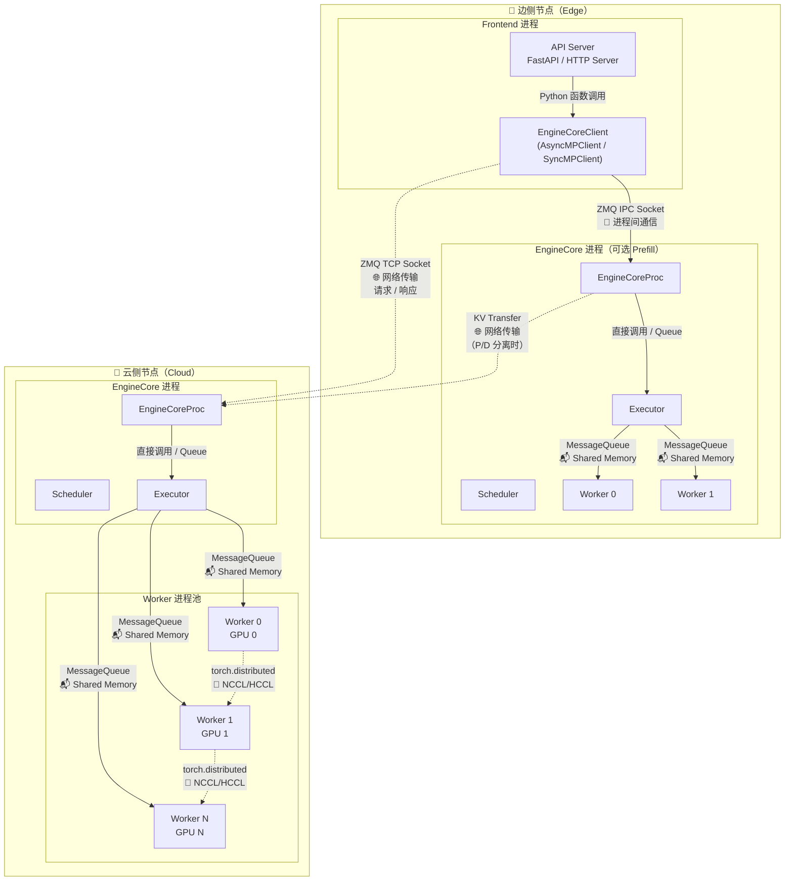

---

## 二、总体流程图（含边云通信）

```mermaid
flowchart TD
    U1([🧑‍💻 用户提交普通请求<br/>纯文本 prompt]) --> F1
    
    F1["边侧 API Server 接收请求<br/>Frontend 进程<br/>FastAPI HTTP Handler"] --> F2
    F2["LLMEngine.generate()<br/>创建生成任务<br/>封装 Request 对象"] --> F3
    F3["EngineCoreClient.add_request(request)<br/>📤 准备发送到 EngineCore"] --> NET1
    
    NET1["ZMQ Socket 序列化发送<br/>🌐 input_socket.send_multipart<br/>Msgpack 编码<br/>跨网络传输到云侧"] --> C1
    
    C1["云侧 EngineCoreProc<br/>input_queue.get()<br/>📥 接收请求"] --> C2
    C2["_handle_client_request()<br/>分发请求类型<br/>ADD / ABORT / UTILITY"] --> C3
    C3["EngineCore.add_request(req)<br/>加入 Scheduler.waiting 队列"] --> C4
    
    C4["run_busy_loop()<br/>🔁 EngineCore 主循环"] --> C5
    C5["_process_input_queue()<br/>处理输入队列中的请求"] --> C6
    C6["Scheduler.schedule()<br/>🚀 调度决策<br/>分配 KV Blocks"] --> C7
    C7["构建 SchedulerOutput<br/>封装调度结果"] --> IPC1
    
    IPC1["Executor.execute_model()<br/>📡 通过 MessageQueue 分发<br/>Shared Memory 广播到 Workers"] --> W1
    
    W1["Worker 接收 SchedulerOutput<br/>反序列化输入数据"] --> W2
    W2["execute_model()<br/>⚙️ 模型推理"] --> W3
    W3["InputEmbedding.forward()<br/>token → hidden_states"] --> W4
    W4["Transformer Forward<br/>Attention + FFN"] --> W5
    W5["Sampler.sample()<br/>生成 next_token_id"] --> W6
    W6["组装 ModelRunnerOutput<br/>序列化结果"] --> IPC2
    
    IPC2["Worker Response MQ<br/>📡 MessageQueue.dequeue<br/>Shared Memory 回传结果<br/>到 Executor"] --> C8
    
    C8["EngineCore.step()<br/>获取 Executor 输出"] --> C9
    C9["Scheduler.update_from_output()<br/>更新请求状态<br/>检查是否完成"] --> C10
    C10{"请求是否完成?"} -->|否| C4
    C10 -->|是| C11
    C11["_free_request()<br/>释放 KV Cache"] --> C12
    C12["output_queue.put()<br/>📤 结果放入输出队列"] --> NET2
    
    NET2["ZMQ Socket 序列化发送<br/>🌐 output_socket.send_multipart<br/>Msgpack 编码<br/>跨网络回传边侧"] --> F4
    
    F4["EngineCoreClient 接收输出<br/>📥 output_socket.recv_multipart<br/>反序列化 EngineCoreOutputs"] --> F5
    F5["Frontend 解析输出<br/>token_ids → 文本"] --> F6
    F6{"stream = True?"} -->|是| F7
    F6 -->|否| F8
    F7["SSE 流式推送<br/>逐个 chunk 返回"] --> U2
    F8["组装完整响应<br/>一次性返回"] --> U2
    
    U2([🧑‍💻 用户收到文本响应])
```

---

## 三、Phase 1：边侧接收与请求发送

### 3.1 边侧 Frontend 接收请求

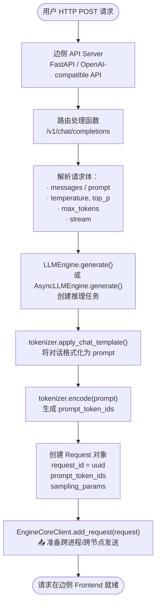

**关键函数**：`vllm/v1/engine/llm_engine.py::LLMEngine.generate()`

```python
def generate(self, prompt, sampling_params, request_id):
    # 1. 创建 Request 对象
    request = EngineCoreRequest(
        request_id=request_id,
        prompt_token_ids=prompt_token_ids,
        sampling_params=sampling_params,
        ...
    )
    # 2. 发送到 EngineCore（可能在云侧）
    self.engine_core.add_request(request)
```

---

### 3.2 边侧到云侧的网络发送（ZMQ）

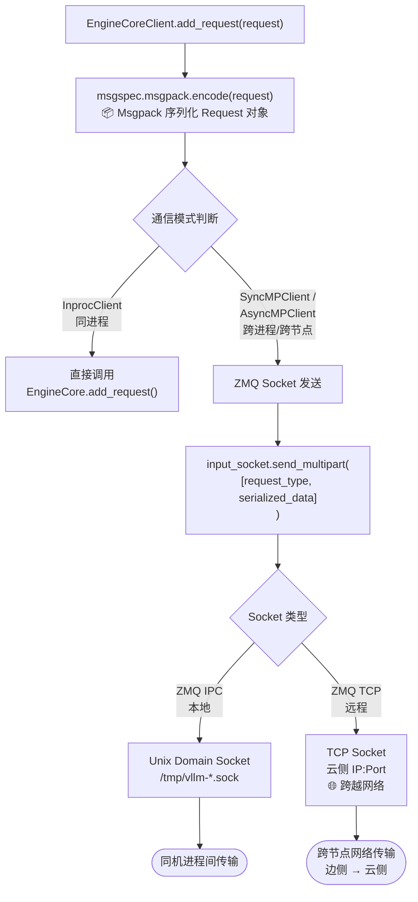

**关键函数**：`vllm/v1/engine/core_client.py::AsyncMPClient.add_request()`

```python
def add_request(self, request: EngineCoreRequest) -> None:
    # 序列化请求
    serialized = msgspec.msgpack.encode(
        (EngineCoreRequestType.ADD, request)
    )
    # 通过 ZMQ Socket 发送（可能是 TCP 跨网络）
    self.input_socket.send_multipart(
        [EngineCoreRequestType.ADD, serialized],
        copy=False
    )
```

---

## 四、Phase 2：云侧 EngineCore 接收与调度

### 4.1 EngineCore 接收请求

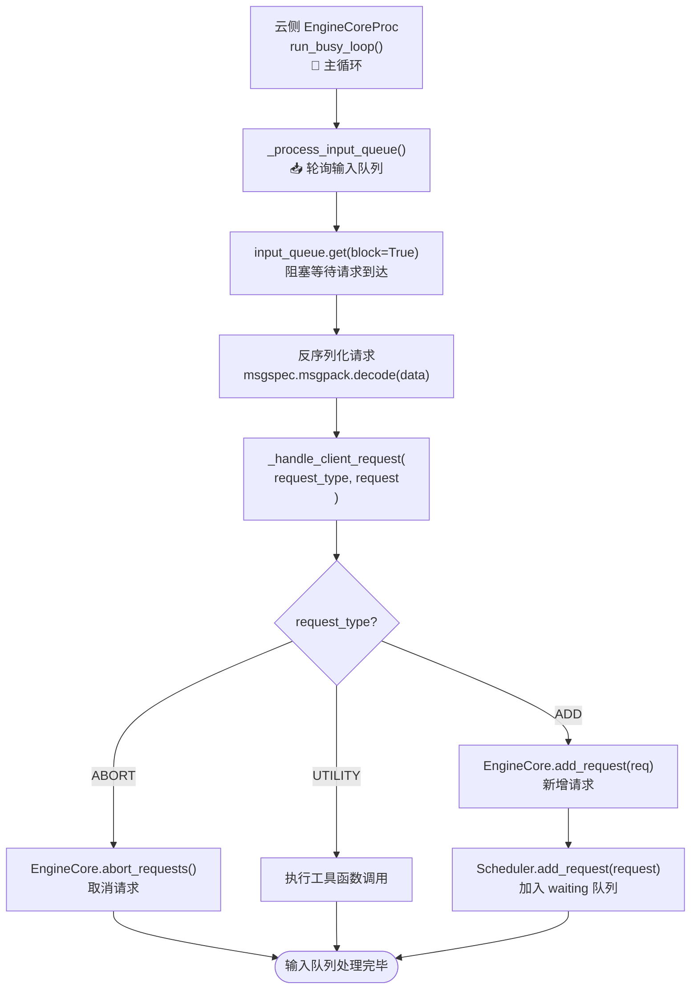

**关键函数**：`vllm/v1/engine/core.py::EngineCoreProc._process_input_queue()`

```python
def _process_input_queue(self):
    # 阻塞等待请求
    req = self.input_queue.get(block=True)
    self._handle_client_request(*req)
    
    # 处理队列中剩余请求
    while not self.input_queue.empty():
        req = self.input_queue.get_nowait()
        self._handle_client_request(*req)

def _handle_client_request(self, request_type, request):
    if request_type == EngineCoreRequestType.ADD:
        self.add_request(request)
```

---

### 4.2 Scheduler 调度循环

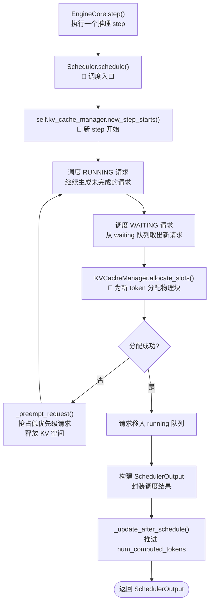

**关键函数**：`vllm/v1/core/sched/scheduler.py::schedule()`

```python
def schedule(self) -> SchedulerOutput:
    self.kv_cache_manager.new_step_starts()
    token_budget = self.max_num_scheduled_tokens
    
    # 调度 RUNNING
    for req in self.running:
        new_blocks = self.kv_cache_manager.allocate_slots(req, ...)
        if new_blocks is None:
            self._preempt_request(req)  # KV 不足，抢占
    
    # 调度 WAITING
    while self.waiting and token_budget > 0:
        req = self.waiting.pop_request()
        self.running.append(req)
    
    return SchedulerOutput(...)
```

---

## 五、Phase 3：Executor 分发与 Worker 执行

### 5.1 Executor 内部分发（MessageQueue）

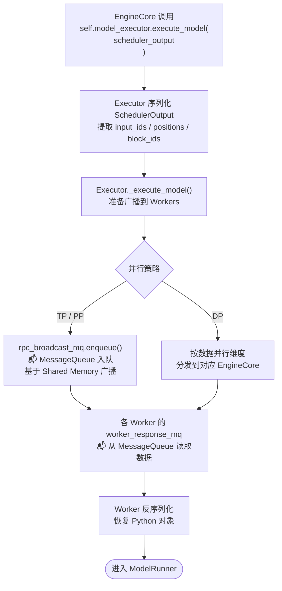

**关键函数**：`vllm/v1/executor/multiproc_executor.py`

```python
def _execute_model(self, method, args, kwargs):
    # 通过 MessageQueue 广播到所有 Workers
    self.rpc_broadcast_mq.enqueue((send_method, args, kwargs))
    
    # 从各 Worker 的 Response MQ 收集结果
    for mq in self.response_mqs:
        status, result = mq.dequeue(timeout=...)
    return result
```

---

### 5.2 Worker 模型推理

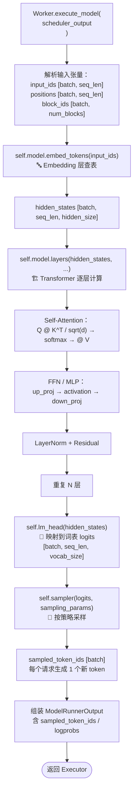

**关键函数**：`vllm/v1/worker/gpu_model_runner.py::execute_model()`

---

### 5.3 Worker 间通信（TP/PP）

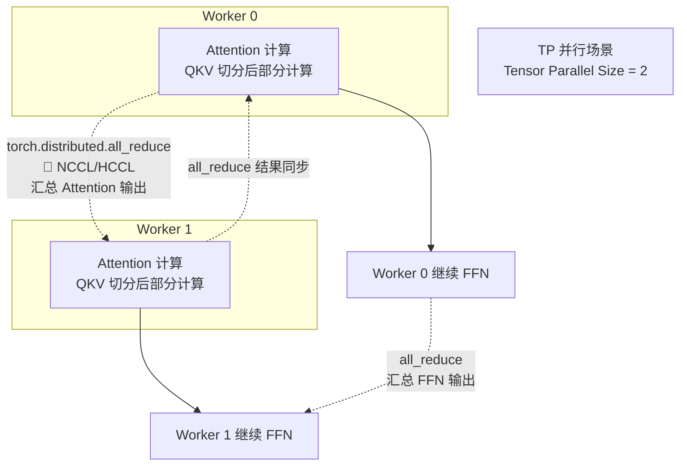

**通信方式**：`torch.distributed.all_reduce` via NCCL (GPU) / HCCL (NPU)

---

## 六、Phase 4：结果回传与边云通信

### 6.1 云侧 EngineCore 更新与输出

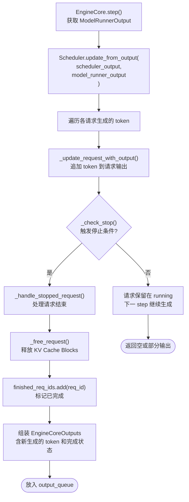

**关键函数**：`vllm/v1/engine/core.py::EngineCore.step()`

```python
def step(self) -> tuple[dict[int, EngineCoreOutputs], bool]:
    scheduler_output = self.scheduler.schedule()
    model_output = self.model_executor.execute_model(scheduler_output)
    outputs = self.scheduler.update_from_output(scheduler_output, model_output)
    return outputs, True
```

---

### 6.2 云侧到边侧的网络回传（ZMQ）

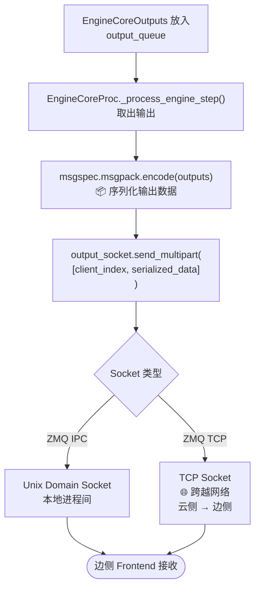

**关键函数**：`vllm/v1/engine/core.py::EngineCoreProc._process_engine_step()`

```python
def _process_engine_step(self) -> bool:
    outputs, model_executed = self.step_fn()
    for output in outputs.items():
        self.output_queue.put_nowait(output)
    return model_executed
```

---

### 6.3 边侧 Frontend 接收与响应

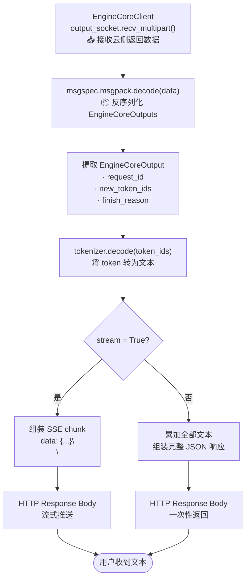

**关键函数**：`vllm/v1/engine/core_client.py::AsyncMPClient._output_queue_task()`

```python
async def _output_queue_task(self):
    while True:
        # 从 ZMQ Socket 接收（可能来自网络）
        frames = await self.output_socket.recv_multipart(copy=False)
        client_idx, output_bytes = frames[0], frames[1]
        # 反序列化
        output = msgspec.msgpack.decode(output_bytes, type=EngineCoreOutputs)
        # 分发到对应的请求
        self._handle_output(client_idx, output)
```

---

## 七、完整时序图（含边云通信与进程间数据传输）

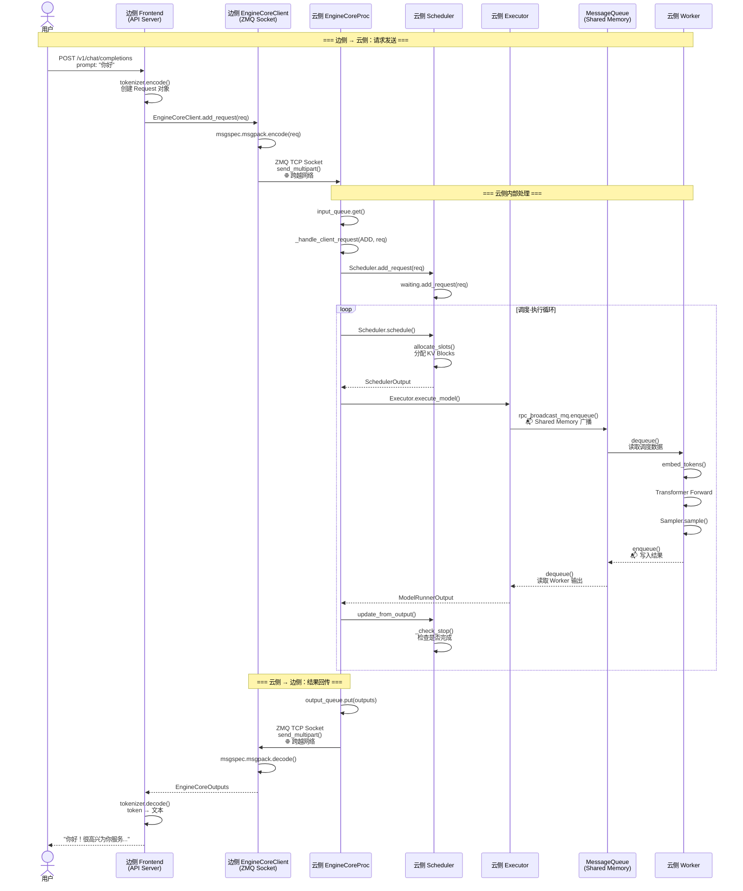

---

## 八、通信机制汇总表

| 通信链路 | 通信方式 | 数据格式 | 场景 |
|---------|---------|---------|------|
| 用户 ↔ 边侧 Frontend | HTTP / SSE | JSON | 用户请求接入 |
| 边侧 Frontend ↔ EngineCoreClient | Python 函数调用 | Python 对象 | 同进程内 |
| **边侧 EngineCoreClient ↔ 云侧 EngineCoreProc** | **ZMQ TCP Socket** | **Msgpack 二进制** | **🌐 边云跨网络通信** |
| 云侧 EngineCoreProc ↔ Scheduler | 直接调用 | Python 对象 | 同进程内 |
| 云侧 EngineCoreProc ↔ Executor | 直接调用 | Python 对象 | 同进程内 |
| 云侧 Executor ↔ Workers | **MessageQueue** | **Msgpack 二进制** | **📡 进程间共享内存** |
| Worker ↔ Worker (TP) | torch.distributed | CUDA Tensor | GPU 间 NCCL/HCCL |
| 云侧 EngineCoreProc ↔ 边侧 EngineCoreClient | **ZMQ TCP Socket** | **Msgpack 二进制** | **🌐 云侧回传边侧** |
| 边侧 EngineCoreClient ↔ Frontend | Python 函数调用 | Python 对象 | 同进程内 |

---

## 九、数据传输大小估算（普通请求）

| 数据 | 方向 | 大小估算 | 说明 |
|------|------|---------|------|
| Request 对象 | 边侧 → 云侧 | ~1-10 KB | prompt_token_ids + sampling_params |
| SchedulerOutput | Executor → Workers | ~100 KB - 1 MB | input_ids / positions / block_ids |
| ModelRunnerOutput | Workers → Executor | ~10 KB - 100 KB | sampled_token_ids / logprobs |
| EngineCoreOutputs | 云侧 → 边侧 | ~1-10 KB | new_token_ids + finish_reason |
| **KV Cache（P/D 分离时）** | **Prefill → Decode** | **数百 MB - 数 GB** | **每层 K/V 张量 × seq_len × hidden_size** |

> 注：普通纯文本请求的 prompt 和输出 token 数据量较小，跨网络传输开销低。若系统启用 P/D 分离，KV Cache 的传输是主要带宽消耗来源。

---

## 十、vllm-ascend 在边云场景中的扩展

| 扩展 | 通信影响 | 说明 |
|------|---------|------|
| **动态批处理** | 云侧 Scheduler 内部 | `BudgetRefiner` 动态调整 batch size，不影响边云通信 |
| **负载均衡 (DP)** | 云侧 ↔ 云侧 / 边侧 ↔ 云侧 | `BalanceScheduler.balance_gather()` 通过 `torch.distributed.all_gather` 同步各 rank 负载 |
| **重计算调度** | 云侧内部 + 边云 | KV Consumer 内存不足时，`RecomputeScheduler` 将请求回退为 `EngineCoreOutput(finish_reason=STOP)`，经 ZMQ 回传边侧后重新路由 |
| **NPU Worker** | Worker 内部 | `NPUModelRunner` 将 CUDA 算子替换为 CANN 算子，边云通信链路不变 |
