# 边云协同模式下普通请求处理流程（含函数与注释）

> 普通请求 = 纯文本输入（无多模态 / 无图片 / 无视频），`request.has_encoder_inputs = False`
>
> 在边云协同系统中，普通请求**不会触发 EC（Encoder Cache）传输**，但完整走标准调度+执行流程。

---

## 一、总体流程图（普通请求）

```mermaid
flowchart TD
    %% 样式定义
    classDef user fill:#e1f5fe,stroke:#01579b,stroke-width:2px
    classDef scheduler fill:#fff3e0,stroke:#e65100,stroke-width:2px
    classDef worker fill:#e8f5e9,stroke:#1b5e20,stroke-width:2px
    classDef skipped fill:#eeeeee,stroke:#757575,stroke-dasharray: 5 5

    U1([🧑‍💻 用户提交普通请求<br/>纯文本 prompt]):::user
    
    S1["Frontend 接收请求<br/>解析 prompt / sampling_params"]:::scheduler
    S2["LLMEngine 封装 Request 对象<br/>request.has_encoder_inputs = False"]:::scheduler
    S3["Scheduler.add_request(request)<br/>📥 加入 waiting 队列，等待调度"]:::scheduler
    S4{"进入调度循环<br/>Scheduler.schedule()"}:::scheduler
    
    S5["self.kv_cache_manager.new_step_starts()<br/>🔄 新 step 开始"]:::scheduler
    S6["【普通请求】_try_schedule_encoder_inputs()<br/>🔍 直接返回空 — 无多模态输入可处理"]:::scheduler
    S7["调度 RUNNING 请求（如有）<br/>标准 token 分配 + KV Block 分配"]:::scheduler
    S8["调度 WAITING 请求（本请求）<br/>从 waiting 队列取出，分配 KV Blocks"]:::scheduler
    S9["【普通请求】ec_connector = None 或未触发<br/>⏭️ 跳过边云 EC 检查与加载"]:::skipped
    S10["构建 SchedulerOutput<br/>ec_connector_metadata = None"]:::scheduler
    S11["_update_after_schedule()<br/>📊 推进 num_computed_tokens"]:::scheduler
    
    E1["Executor 分发 SchedulerOutput<br/>📤 广播到各 Worker"]:::worker
    
    W1["Worker.execute_model(scheduler_output)<br/>⚙️ 接收调度输出"]:::worker
    W2["【普通请求】无多模态输入<br/>⏭️ 跳过 EC Connector Context Manager<br/>或进入但 has_ec_transfer() 无实际作用"]:::skipped
    W3["InputEmbedding 层查表<br/>将 token_ids 转为 hidden_states"]:::worker
    W4["Transformer Forward<br/>计算 attention + ffn"]:::worker
    W5["Sampler 采样<br/>生成下一个 token_id"]:::worker
    W6["返回 ModelRunnerOutput<br/>📦 含 sampled_token_ids / logprobs 等"]:::worker
    
    S12["Scheduler.update_from_output()<br/>🔄 根据 Worker 输出更新请求状态"]:::scheduler
    S13{"请求是否完成?<br/>生成结束符 / 达到 max_tokens"}:::scheduler
    S14["_free_request()<br/>🗑️ 释放 KV Cache + 从 running 移除"]:::scheduler
    S15["返回 EngineCoreOutput<br/>📤 将新生成的 token 回传给 Frontend"]:::scheduler
    
    U2([🧑‍💻 用户收到文本响应<br/>流式或完整结果]):::user
    
    %% 连接关系
    U1 --> S1 --> S2 --> S3 --> S4
    S4 --> S5 --> S6 --> S7 --> S8 --> S9 --> S10 --> S11
    S11 --> E1 --> W1 --> W2 --> W3 --> W4 --> W5 --> W6
    W6 --> S12 --> S13
    S13 -->|未完成| S4
    S13 -->|已完成| S14 --> S15 --> U2
```

---

## 二、Phase 1：请求接收与入队

```mermaid
flowchart TD
    A([用户提交请求<br/>如："请介绍北京"]) --> B["Frontend HTTP Server<br/>接收 HTTP/gRPC 请求"]
    B --> C["解析请求体<br/>prompt / temperature / max_tokens / stream 等参数"]
    C --> D["LLMEngine.generate()<br/>或 AsyncLLMEngine.generate()"]
    D --> E["创建 Request 对象<br/>封装 prompt_token_ids + sampling_params"]
    E --> F{"request.has_encoder_inputs?<br/>是否含多模态输入?"}
    F -->|普通请求| G["False<br/>request.mm_features = []"]
    F -->|多模态请求| H["True<br/>request.mm_features = [图片A, 图片B]"]
    G --> I["Scheduler.add_request(request)"]
    H --> I
    I --> J["self.waiting.add_request(request)<br/>按 SchedulingPolicy 排序入队"]
    J --> K["self.requests[request_id] = request<br/>建立 id 到 Request 的映射"]
    K --> L([请求已在 waiting 队列<br/>等待 schedule() 调度])
```

**关键代码**：`vllm/v1/core/sched/scheduler.py::add_request()`

```python
def add_request(self, request: Request) -> None:
    # 普通请求：request.has_encoder_inputs = False
    # request.mm_features 为空列表
    self.waiting.add_request(request)
    self.requests[request.request_id] = request
    if self.log_stats:
        request.record_event(EngineCoreEventType.QUEUED)
```

---

## 三、Phase 2：调度器调度（普通请求不走 EC）

### 3.1 主调度入口

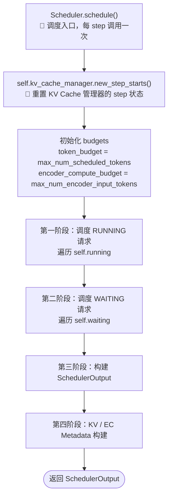

**关键代码**：`vllm/v1/core/sched/scheduler.py::schedule()`

```python
def schedule(self) -> SchedulerOutput:
    token_budget = self.max_num_scheduled_tokens
    self.kv_cache_manager.new_step_starts()
    
    # 1) 调度 RUNNING 请求
    while req_index < len(self.running) and token_budget > 0:
        request = self.running[req_index]
        # ... token 分配逻辑 ...
        # 普通请求：num_new_tokens = min(待计算token数, token_budget)
        # 分配 KV blocks ...
    
    # 2) 调度 WAITING 请求
    while self.waiting and token_budget > 0:
        request = self.waiting.peek_request()
        # ... 检查状态、分配 KV blocks ...
    
    # 3) 构建输出
    scheduler_output = SchedulerOutput(...)
    
    # 普通请求：ec_connector_metadata = None
    if self.ec_connector is not None:
        # 由于普通请求无 encoder inputs，build_connector_meta 返回空 meta
        ec_meta = self.ec_connector.build_connector_meta(scheduler_output)
        scheduler_output.ec_connector_metadata = ec_meta
    
    self._update_after_schedule(scheduler_output)
    return scheduler_output
```

---

### 3.2 普通请求跳过 EC 的关键点

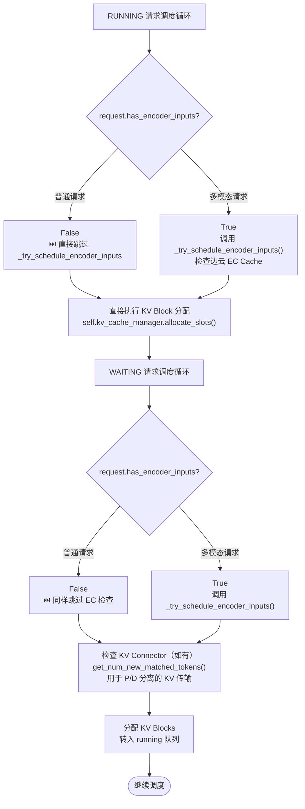

**关键代码**：`vllm/v1/core/sched/scheduler.py::schedule()` 中的条件分支

```python
# RUNNING 请求部分
if request.has_encoder_inputs:
    # 多模态请求才会进入
    (encoder_inputs_to_schedule, num_new_tokens, ...) = \
        self._try_schedule_encoder_inputs(...)
# 普通请求直接跳过上述 if 块

# 普通请求直接走：
new_blocks = self.kv_cache_manager.allocate_slots(
    request, num_new_tokens, num_lookahead_tokens=...
)
```

---

### 3.3 _try_schedule_encoder_inputs 对普通请求的直接返回

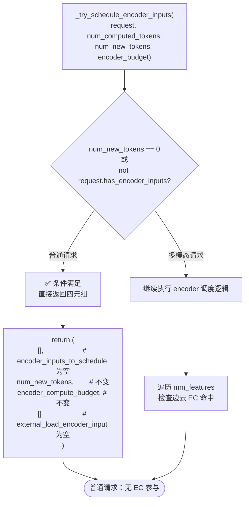

**关键代码**：`vllm/v1/core/sched/scheduler.py::_try_schedule_encoder_inputs()` 入口

```python
def _try_schedule_encoder_inputs(self, request, num_computed_tokens,
                                  num_new_tokens, encoder_compute_budget):
    # ⚡ 普通请求直接在这里返回，不做任何事
    if num_new_tokens == 0 or not request.has_encoder_inputs:
        return [], num_new_tokens, encoder_compute_budget, []
    
    # 以下逻辑只有多模态请求才会执行
    for i, mm_feature in enumerate(request.mm_features):
        if self.ec_connector is not None and self.ec_connector.has_cache_item(
            item_identifier
        ):
            external_load_encoder_input.append(i)  # 边云命中
        # ...
```

---

### 3.4 构建输出：普通请求的 ec_connector_metadata

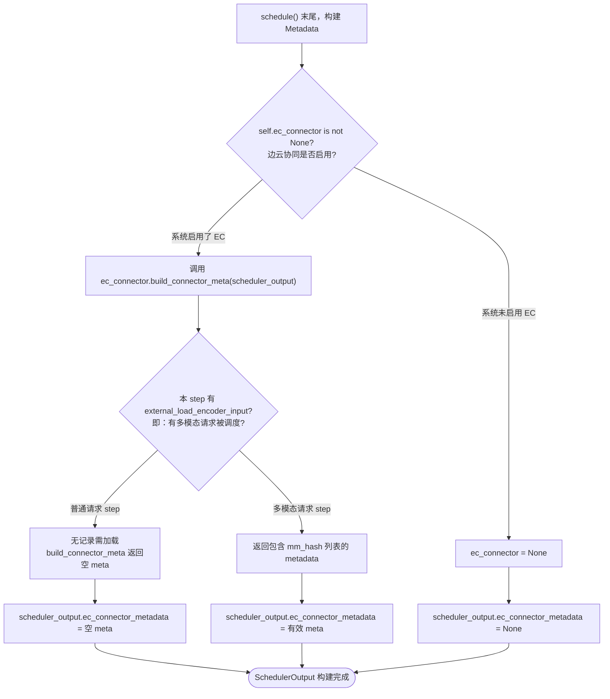

**关键代码**：`vllm/v1/core/sched/scheduler.py::schedule()` 末尾

```python
# Build the connector meta for ECConnector
if self.ec_connector is not None:
    ec_meta: ECConnectorMetadata = self.ec_connector.build_connector_meta(
        scheduler_output
    )
    scheduler_output.ec_connector_metadata = ec_meta
    # 普通请求 step：ec_meta 为空，因为无 mm_datas 被记录
```

---

## 四、Phase 3：Worker 执行（普通请求不走 EC）

### 4.1 Worker 接收与执行

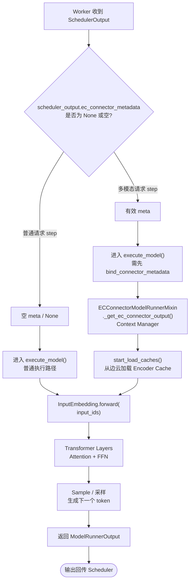

**关键代码**：`vllm/v1/worker/gpu_model_runner.py::execute_model()`（简化示意）

```python
def execute_model(self, scheduler_output):
    # 普通请求：ec_connector_metadata = None 或空
    # 不会触发实际的 EC 加载/保存逻辑
    
    # 1) 文本 embedding 查表
    hidden_states = self.model.embed_tokens(input_ids)
    
    # 2) Transformer Forward
    hidden_states = self.model.layers(hidden_states, ...)
    
    # 3) 采样
    logits = self.lm_head(hidden_states)
    sampled_token_ids = self.sampler(logits, ...)
    
    return ModelRunnerOutput(
        sampled_token_ids=sampled_token_ids,
        # ...
    )
```

---

### 4.2 普通请求在 ModelRunner 中跳过 EC 的详细路径

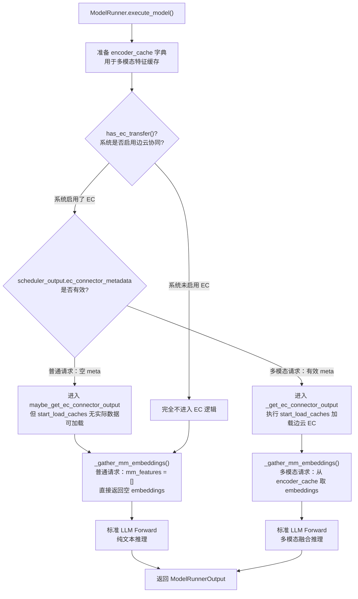

**关键代码**：`vllm/v1/worker/ec_connector_model_runner_mixin.py`

```python
# 普通请求的场景：
# has_ec_transfer() = True（系统启用）
# 但 scheduler_output.ec_connector_metadata = None 或空
# 因此 Context Manager 内 start_load_caches 无实际操作

@contextmanager
def _get_ec_connector_output(scheduler_output, encoder_cache, **kwargs):
    output = ECConnectorOutput()
    ec_connector = get_ec_transfer()
    ec_connector.bind_connector_metadata(scheduler_output.ec_connector_metadata)
    
    if ec_connector.is_consumer:
        ec_connector.start_load_caches(encoder_cache, **kwargs)
        # 普通请求：metadata 为空，无 mm_datas，不做任何事
    
    try:
        yield output
    finally:
        ec_connector.get_finished(scheduler_output.finished_req_ids)
        ec_connector.clear_connector_metadata()
```

---

## 五、Phase 4：状态更新与结果返回

### 5.1 Scheduler 更新请求状态

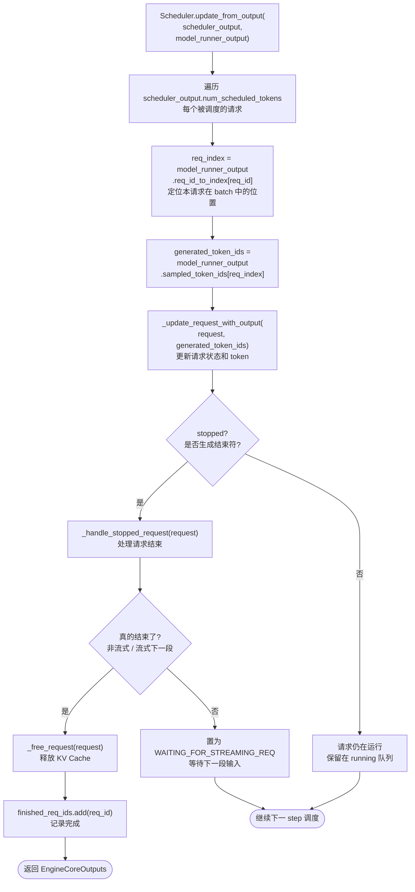

**关键代码**：`vllm/v1/core/sched/scheduler.py::update_from_output()`

```python
def update_from_output(self, scheduler_output, model_runner_output):
    for req_id, num_tokens_scheduled in scheduler_output.num_scheduled_tokens.items():
        request = self.requests[req_id]
        req_index = model_runner_output.req_id_to_index[req_id]
        generated_token_ids = model_runner_output.sampled_token_ids[req_index]
        
        # 更新请求状态
        new_token_ids, stopped = self._update_request_with_output(
            request, generated_token_ids
        )
        
        if stopped:
            finished = self._handle_stopped_request(request)
            if finished:
                kv_transfer_params = self._free_request(request)
                self.finished_req_ids.add(req_id)
```

---

### 5.2 请求完成释放资源（普通请求无 EC）

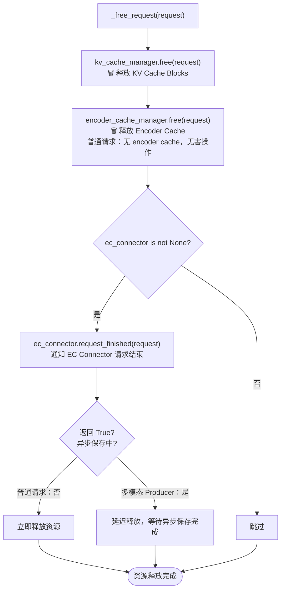

**关键代码**：`vllm/v1/core/sched/scheduler.py::_free_request()`（简化示意）

```python
def _free_request(self, request):
    self.kv_cache_manager.free(request)
    self.encoder_cache_manager.free(request)
    # 普通请求：encoder_cache_manager.free 无实际操作
    
    if self.ec_connector is not None:
        is_async, _ = self.ec_connector.request_finished(request)
        # 普通请求：request_finished 返回 False，立即释放
    
    return kv_transfer_params
```

---

## 六、普通请求 vs 多模态请求对比

```mermaid
flowchart TD
    subgraph Common["🔷 普通请求（纯文本）"]
        C1["add_request()"] --> C2["schedule()"]
        C2 --> C3["⏭️ 跳过 _try_schedule_encoder_inputs<br/>直接返回空"]
        C3 --> C4["分配 KV Blocks"]
        C4 --> C5["ec_connector_metadata = None / 空"]
        C5 --> C6["Worker.execute_model()"]
        C6 --> C7["⏭️ 无 EC 加载/保存"]
        C7 --> C8["InputEmbedding + LLM Forward"]
        C8 --> C9["update_from_output()"]
    end
    
    subgraph MM["🔶 多模态请求（含图片）"]
        M1["add_request()"] --> M2["schedule()"]
        M2 --> M3["_try_schedule_encoder_inputs()<br/>检查边云 EC 命中"]
        M3 --> M4["分配 KV Blocks + Encoder Cache"]
        M4 --> M5["ec_connector_metadata = 有效 meta"]
        M5 --> M6["Worker.execute_model()"]
        M6 --> M7["bind → load / save → clear<br/>EC Connector 完整生命周期"]
        M7 --> M8["_gather_mm_embeddings + LLM Forward"]
        M8 --> M9["update_from_output()"]
    end
```

| 步骤 | 普通请求 | 多模态请求（边云协同） |
|------|---------|---------------------|
| `has_encoder_inputs` | `False` | `True` |
| `_try_schedule_encoder_inputs` | ⚡ 入口直接返回空 | 遍历 `mm_features`，检查 `has_cache_item` |
| `ec_connector.update_state_after_alloc` | ❌ 不调用 | ✅ 记录需加载的 EC |
| `ec_connector.build_connector_meta` | 返回空 meta | 返回含 `mm_hash` 列表的 meta |
| Worker `start_load_caches` | 无实际操作 | 从边云加载 Encoder Cache |
| Worker `save_caches` | 无实际操作 | 将新计算的 EC 写入边云 |
| `encoder_cache_manager.free` | 无害空操作 | 释放本地多模态缓存 |
| `ec_connector.request_finished` | 返回 False | 可能返回 True（异步保存中） |

---

## 七、完整时序图：普通请求的一生

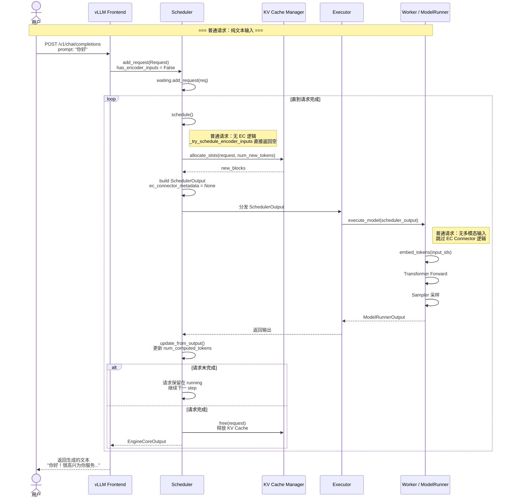

---

## 八、总结

**普通请求在边云协同系统中的核心特征**：

1. **EC 系统不介入**：由于 `request.has_encoder_inputs = False`，`_try_schedule_encoder_inputs()` 在入口处直接返回空，整个 EC Connector 链路（`has_cache_item` → `update_state_after_alloc` → `build_connector_meta` → `start_load_caches` / `save_caches`）均**不被触发**。

2. **走标准 vLLM 调度流程**：waiting 队列 → running 队列 → KV Block 分配 → Transformer Forward → Sampler 采样 → 结果返回。

3. **KV Transfer 仍可能参与**：如果系统配置了 P/D 分离（`kv_transfer_config`），普通请求仍会通过 `KVConnector` 进行 KV Cache 的远程加载/保存，这与 EC 是**独立的两套传输机制**。

4. **资源释放简单**：请求完成后 `_free_request()` 释放 KV Cache，由于无 Encoder Cache，清理工作更轻量。
