# 边云协同模式下用户请求处理流程图（含函数与注释）

> 基于 vLLM v1 + vllm-ascend，逐函数标注边云协同（EC Transfer）处理用户请求的完整链路

---

## 一、总览流程图

```mermaid
flowchart TD
    %% 定义样式
    classDef user fill:#e1f5fe,stroke:#01579b,stroke-width:2px
    classDef scheduler fill:#fff3e0,stroke:#e65100,stroke-width:2px
    classDef worker fill:#e8f5e9,stroke:#1b5e20,stroke-width:2px
    classDef cloud fill:#f3e5f5,stroke:#4a148c,stroke-width:2px
    classDef edge fill:#fce4ec,stroke:#880e4f,stroke-width:2px

    U1([🧑‍💻 用户提交请求<br/>含多模态输入]):::user
    
    S1["Scheduler.add_request(request)<br/>📥 接收用户请求，放入 waiting 队列"]:::scheduler
    S2["Scheduler.schedule()<br/>🔄 执行调度循环，决定本 step 执行哪些请求"]:::scheduler
    S3["_try_schedule_encoder_inputs()<br/>🔍 判断多模态输入是否需要本地编码或边云加载"]:::scheduler
    S4{"ec_connector.has_cache_item(mm_hash)<br/>❓ 边云共享存储中是否已有该图片的 Encoder Cache?"}:::scheduler
    S5["ec_connector.update_state_after_alloc(req, idx)<br/>📝 记录需要从边云加载的 EC 条目"]:::scheduler
    S6["ec_connector.build_connector_meta(scheduler_output)<br/>📦 打包本 step 所有需加载的 EC 元数据"]:::scheduler
    S7["返回 SchedulerOutput<br/>✅ 包含 ec_connector_metadata + kv_connector_metadata"]:::scheduler
    
    E1["Executor 分发 SchedulerOutput<br/>📤 将调度输出广播到各个 Worker 进程"]:::cloud
    
    W1["Worker 接收 SchedulerOutput<br/>📥 获取本 step 需执行的请求列表及 EC 元数据"]:::worker
    W2["ECConnectorModelRunnerMixin<br/>._get_ec_connector_output()<br/>🔧 进入 EC 生命周期上下文管理器"]:::worker
    W3["ec_connector.bind_connector_metadata(meta)<br/>🔗 绑定 Scheduler 传来的 EC 加载清单"]:::worker
    W4{"ec_connector.is_consumer?<br/>❓ 本节点是否为 EC Consumer（云端复用）?"}:::worker
    W5["ec_connector.start_load_caches(encoder_cache)<br/>☁️ 从边云共享存储加载 Encoder Cache 到本地"]:::worker
    W6["_gather_mm_embeddings()<br/>🧩 将 Encoder Cache 转换为模型可用的 embeddings"]:::worker
    W7["execute_model() / forward()<br/>⚙️ 执行 Transformer 推理"]:::worker
    W8{"ec_connector.is_producer?<br/>❓ 本节点是否为 EC Producer（边缘生产）?"}:::worker
    W9["ec_connector.save_caches(encoder_cache, mm_hash)<br/>💾 将新计算的 Encoder Cache 写入边云共享存储"]:::worker
    W10["ec_connector.get_finished(finished_req_ids)<br/>✔️ 获取异步传输完成状态"]:::worker
    W11["ec_connector.clear_connector_metadata()<br/>🧹 解绑并清理 EC 元数据"]:::worker
    
    S8["Scheduler.update_from_output()<br/>📊 根据 Worker 输出更新请求状态（num_computed_tokens 等）"]:::scheduler
    S9{"请求已完成?<br/>❓ 是否生成结束符或达到最大长度"}:::scheduler
    S10["ec_connector.request_finished(request)<br/>🔚 请求结束，决定是否保留/释放 EC Cache"]:::scheduler
    
    U2([🧑‍💻 用户收到响应<br/>生成的文本结果]):::user
    
    %% 连接
    U1 --> S1
    S1 --> S2
    S2 --> S3
    S3 --> S4
    S4 -->|命中| S5
    S4 -->|未命中| S2
    S5 --> S6
    S6 --> S7
    S7 --> E1
    E1 --> W1
    W1 --> W2
    W2 --> W3
    W3 --> W4
    W4 -->|是| W5
    W4 -->|否| W6
    W5 --> W6
    W6 --> W7
    W7 --> W8
    W8 -->|是| W9
    W8 -->|否| W10
    W9 --> W10
    W10 --> W11
    W11 --> S8
    S8 --> S9
    S9 -->|否| S2
    S9 -->|是| S10
    S10 --> U2
```

---

## 二、Phase 1：请求接收与调度（Scheduler 侧）

### 2.1 请求进入系统

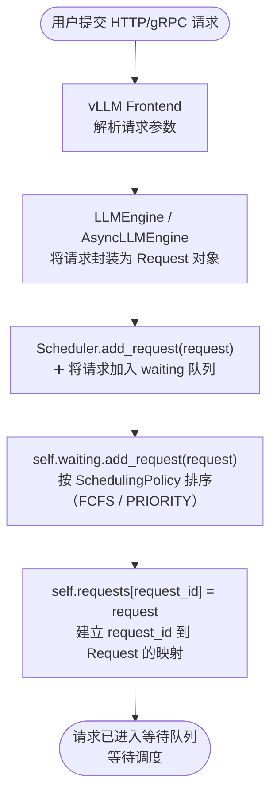

**关键代码位置**：`vllm/v1/core/sched/scheduler.py`（基类）或 `vllm_ascend/core/recompute_scheduler.py`（vllm-ascend 重载）

```python
# 简化示意
def add_request(self, request: Request) -> None:
    self.waiting.add_request(request)          # 加入等待队列
    self.requests[request.request_id] = request # 建立索引
```

---

### 2.2 主调度循环

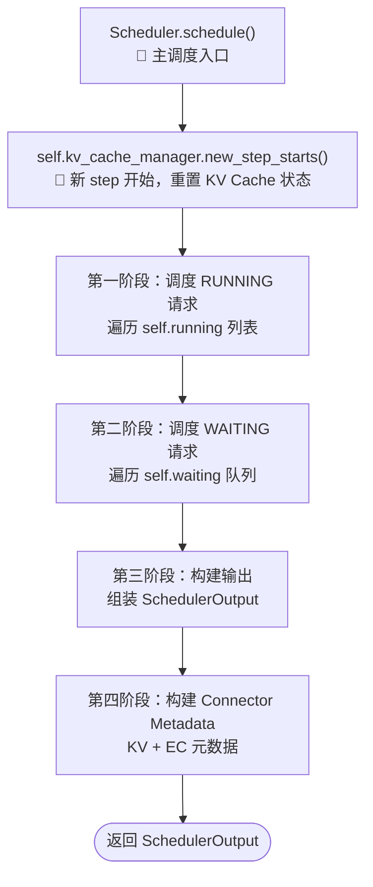

**关键代码位置**：`vllm/v1/core/sched/scheduler.py::schedule()`

```python
def schedule(self) -> SchedulerOutput:
    self.kv_cache_manager.new_step_starts()
    # ... 调度 RUNNING ...
    # ... 调度 WAITING ...
    scheduler_output = SchedulerOutput(...)
    if self.connector is not None:
        scheduler_output.kv_connector_metadata = self.connector.build_connector_meta(...)
    if self.ec_connector is not None:
        scheduler_output.ec_connector_metadata = self.ec_connector.build_connector_meta(...)
    self._update_after_schedule(scheduler_output)
    return scheduler_output
```

---

### 2.3 RUNNING 请求调度中的 EC 处理

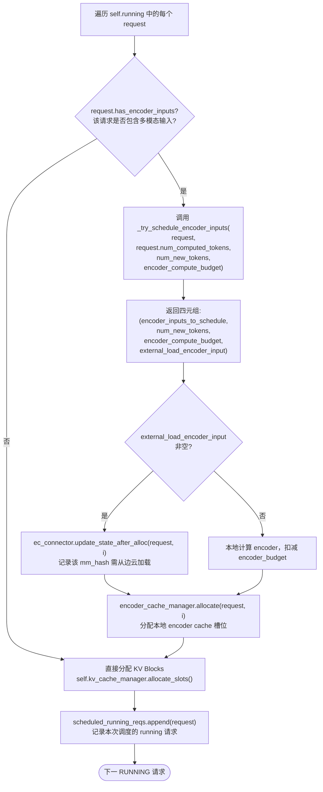

**关键代码位置**：`vllm/v1/core/sched/scheduler.py::schedule()` 第一段循环

---

### 2.4 _try_schedule_encoder_inputs 详细逻辑

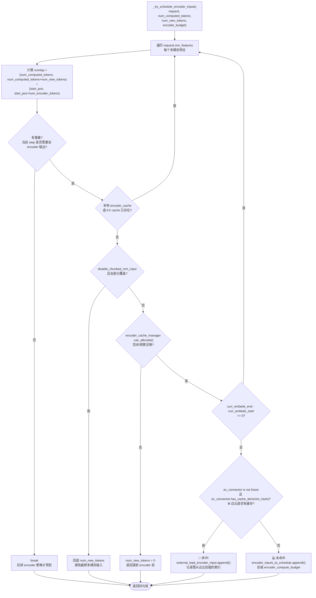

**关键代码位置**：`vllm/v1/core/sched/scheduler.py::_try_schedule_encoder_inputs()`

```python
def _try_schedule_encoder_inputs(self, request, num_computed_tokens,
                                  num_new_tokens, encoder_compute_budget):
    for i, mm_feature in enumerate(request.mm_features):
        # ... overlap 计算 ...
        if self.ec_connector is not None and self.ec_connector.has_cache_item(
            item_identifier
        ):
            external_load_encoder_input.append(i)  # 边云命中
            continue
        encoder_inputs_to_schedule.append(i)        # 本地计算
        encoder_compute_budget -= num_encoder_embeds
    return (encoder_inputs_to_schedule, num_new_tokens,
            encoder_compute_budget, external_load_encoder_input)
```

---

### 2.5 WAITING 请求调度中的 EC 处理

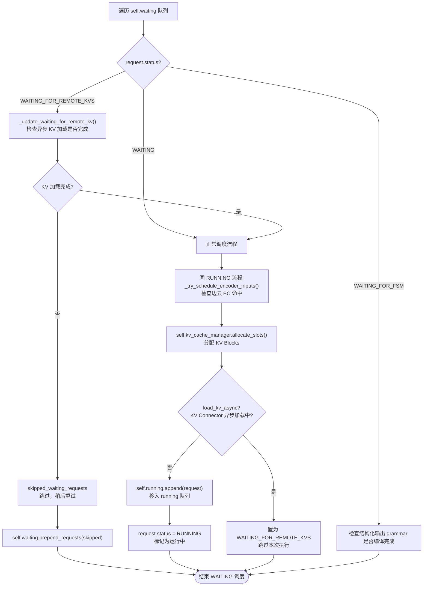

**关键代码位置**：`vllm/v1/core/sched/scheduler.py::schedule()` 第二段循环

---

### 2.6 构建 EC Connector Metadata

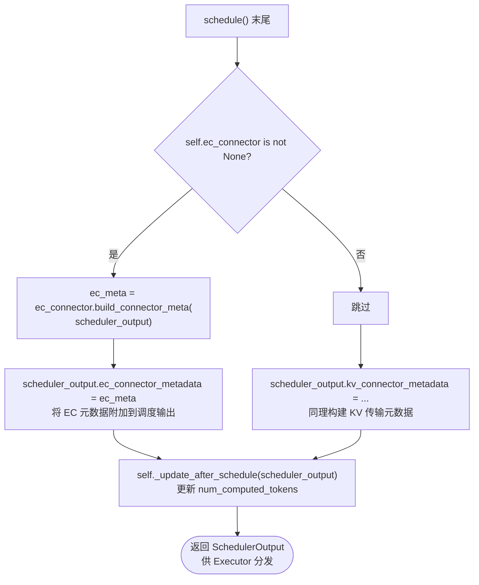

**关键代码位置**：`vllm/v1/core/sched/scheduler.py::schedule()` 末尾

```python
# Build the connector meta for ECConnector
if self.ec_connector is not None:
    ec_meta: ECConnectorMetadata = self.ec_connector.build_connector_meta(
        scheduler_output
    )
    scheduler_output.ec_connector_metadata = ec_meta
```

---

## 三、Phase 2：请求执行（Worker / ModelRunner 侧）

### 3.1 Executor 分发到 Worker

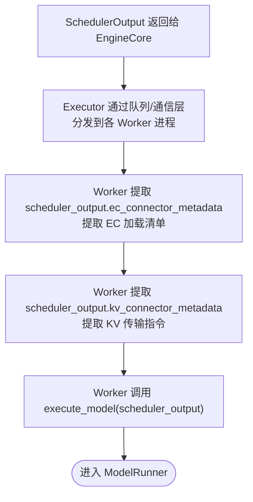

**关键代码位置**：`vllm/v1/executor/multiproc_executor.py` 或 `vllm/v1/executor/ray_executor.py`

---

### 3.2 ModelRunner 中的 EC 生命周期（Context Manager）

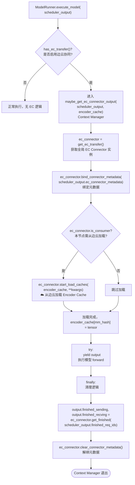

**关键代码位置**：`vllm/v1/worker/ec_connector_model_runner_mixin.py::ECConnectorModelRunnerMixin._get_ec_connector_output()`

```python
@contextmanager
def _get_ec_connector_output(scheduler_output, encoder_cache, **kwargs):
    output = ECConnectorOutput()
    ec_connector = get_ec_transfer()
    ec_connector.bind_connector_metadata(scheduler_output.ec_connector_metadata)
    
    if ec_connector.is_consumer:
        ec_connector.start_load_caches(encoder_cache, **kwargs)
    
    try:
        yield output
    finally:
        output.finished_sending, output.finished_recving = \
            ec_connector.get_finished(scheduler_output.finished_req_ids)
        ec_connector.clear_connector_metadata()
```

---

### 3.3 多模态 Embeddings  gathering（含 EC 加载）

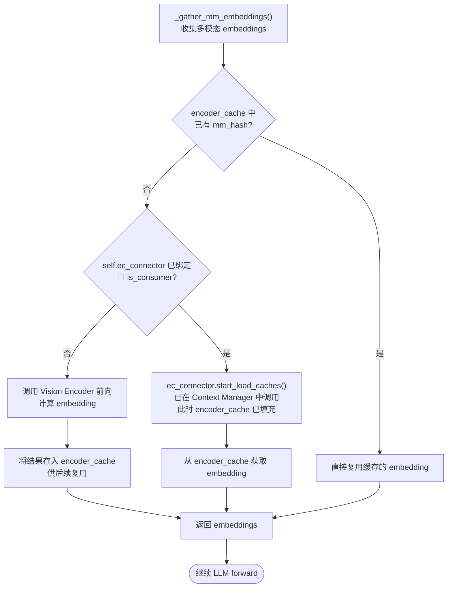

**关键代码位置**：`vllm/v1/worker/gpu_model_runner.py::_gather_mm_embeddings()`（或 vllm-ascend 对应实现）

---

### 3.4 模型执行与 EC 保存（Producer 场景）

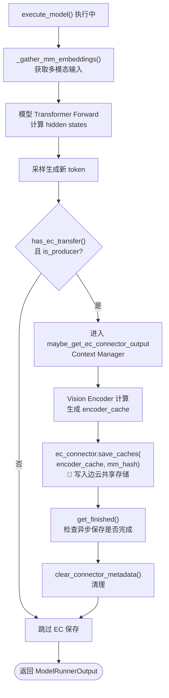

**关键代码位置**：`vllm/v1/worker/gpu_model_runner.py` / `vllm_ascend/worker/model_runner_v1.py`

```python
# GPU ModelRunner 中的 Producer 保存点（简化）
if has_ec_transfer() and get_ec_transfer().is_producer:
    with self.maybe_get_ec_connector_output(
        scheduler_output, encoder_cache
    ) as ec_connector_output:
        # 在 forward 过程中或之后
        # save_caches 被内部调用
        pass
```

---

### 3.5 不同 EC 角色的执行路径对比

```mermaid
flowchart TD
    subgraph Producer["🔷 Producer 角色（Edge 端）"]
        P1["execute_model() 开始"] --> P2["_gather_mm_embeddings()<br/>本地 Vision Encoder 计算"]
        P2 --> P3["forward + sampling"]
        P3 --> P4["save_caches(encoder_cache, mm_hash)<br/>💾 写入边云"]
        P4 --> P5["get_finished()<br/>确认写入完成"]
        P5 --> P6["返回结果"]
    end
    
    subgraph Consumer["🔶 Consumer 角色（Cloud 端）"]
        C1["execute_model() 开始"] --> C2["start_load_caches(encoder_cache)<br/>☁️ 从边云读取"]
        C2 --> C3["_gather_mm_embeddings()<br/>直接使用加载的 cache"]
        C3 --> C4["forward + sampling<br/>跳过 Vision Encoder"]
        C4 --> C5["get_finished()<br/>确认读取完成"]
        C5 --> C6["返回结果"]
    end
    
    subgraph Both["🟣 Both 角色（边云融合节点）"]
        B1["execute_model() 开始"] --> B2["start_load_caches()<br/>尝试从边云读取"]
        B2 --> B3["_gather_mm_embeddings()<br/>命中则复用，未命中则本地计算"]
        B3 --> B4["forward + sampling"]
        B4 --> B5["save_caches()<br/>将新计算结果写回边云"]
        B5 --> B6["get_finished()<br/>确认传输完成"]
        B6 --> B7["返回结果"]
    end
```

---

## 四、Phase 3：结果返回与状态更新（Scheduler 侧）

### 4.1 update_from_output 处理

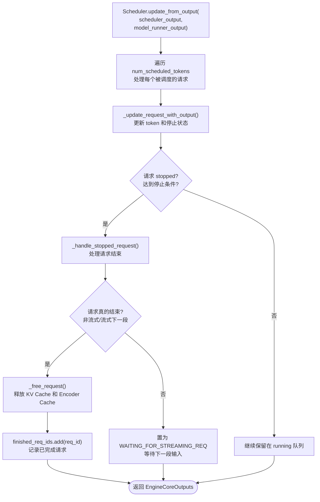

**关键代码位置**：`vllm/v1/core/sched/scheduler.py::update_from_output()`

---

### 4.2 EC 请求结束处理

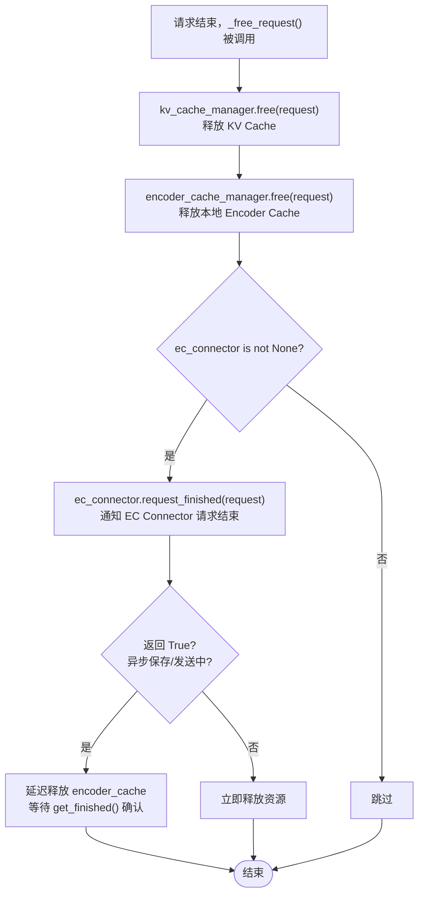

**关键代码位置**：`vllm/distributed/ec_transfer/ec_connector/base.py::request_finished()`

```python
def request_finished(self, request: Request) -> tuple[bool, dict[str, Any] | None]:
    """
    Returns:
        True if the request is being saved/sent asynchronously and cached
        should not be freed until the request_id is returned from get_finished().
    """
    return False, None
```

---

## 五、完整时序图（Producer → Consumer 跨节点）

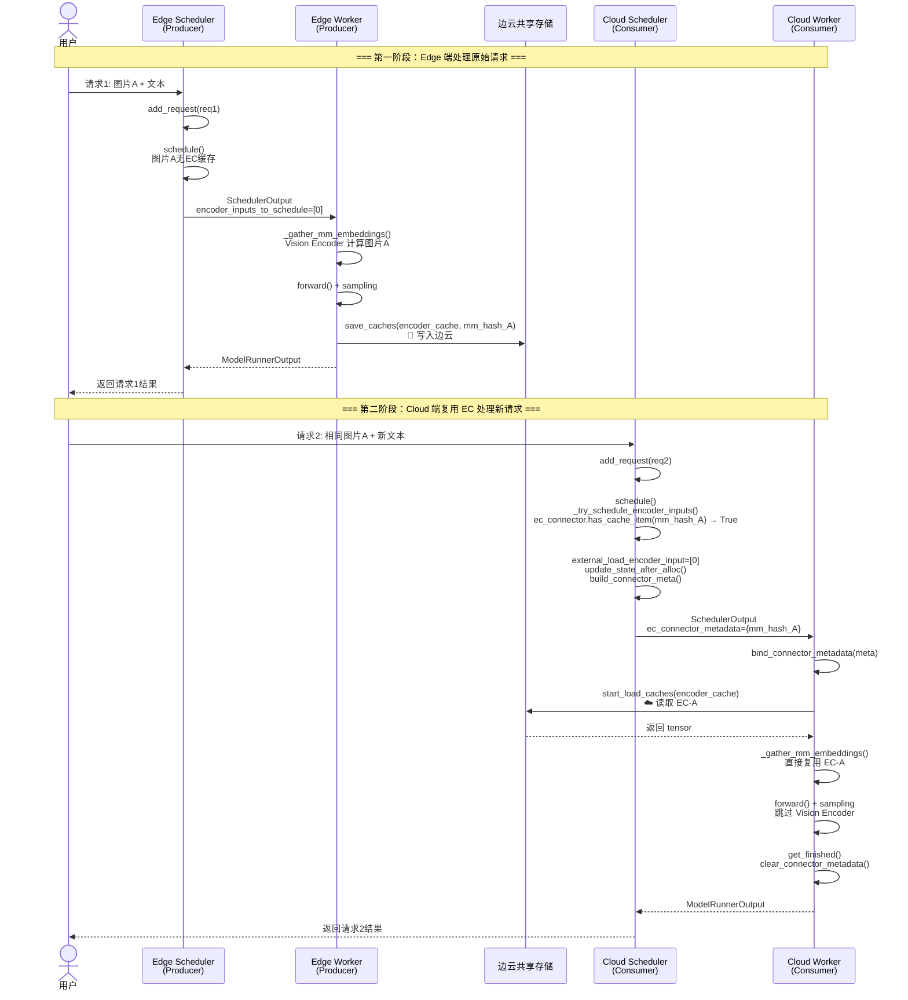

---

## 六、vllm-ascend 扩展点标注

| 扩展功能 | 涉及类/函数 | 与 EC 的交互 |
|---------|-----------|------------|
| **动态批处理** | `SchedulerDynamicBatch.schedule()` | 在标准 EC 检查前，先通过 `BudgetRefiner.refine_budget()` 动态调整 token budget；采用 decode-first 策略重排 running 队列 |
| **重计算调度** | `RecomputeScheduler.schedule()` | 当 KV Consumer 内存不足时，传统 Scheduler 会 preempt，而 RecomputeScheduler 将请求加入 `recomputed_reqs`，通过 PD Proxy 回退到 Prefill 节点；EC 检查逻辑与基类相同 |
| **负载均衡** | `BalanceScheduler.balance_gather()` | 在 DP 场景下，schedule() 的 WAITING 阶段会检查 `balance_flag`，防止单 rank 过载；EC 元数据构建不受影响 |
| **MTP KV Consumer** | `RecomputeScheduler.add_request()` | 为支持 MTP（Multi-Token Prediction），填充 `spec_token_ids` 为 placeholder；EC 加载流程不受影响 |
| **Hybrid Model** | `RecomputeScheduler.add_request()` | 对 qwen3_next / qwen3_5 模型，作为 KV Producer 时会移除 prompt 最后一个 token；EC 的 save/load 流程独立 |
