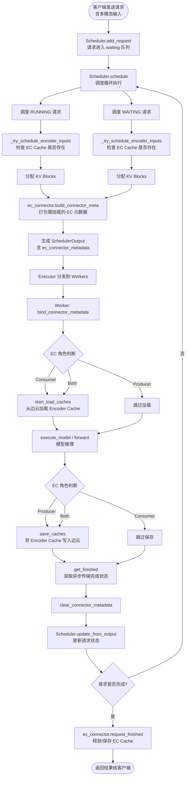
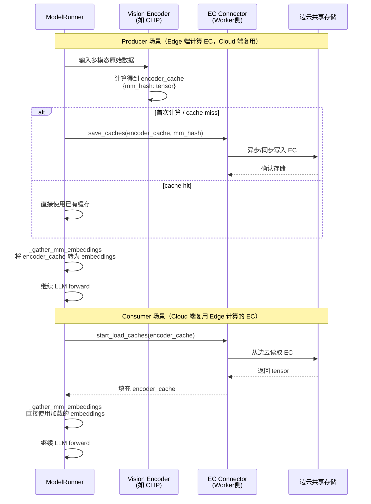
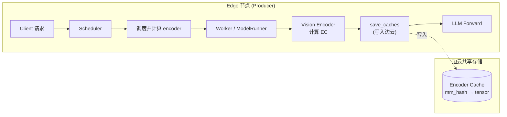
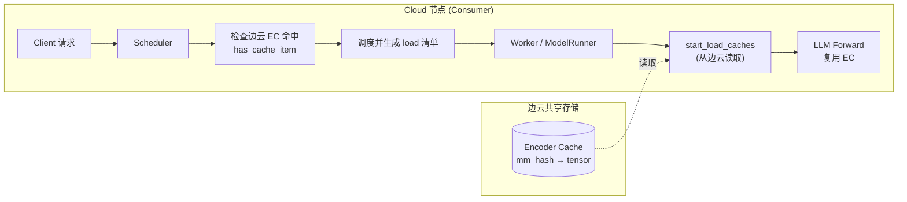

# 边云协同（EC Transfer）模式下请求处理流程图

> 基于 vLLM v1 + vllm-ascend，覆盖 Encoder Cache（EC）在边云间的传输与调度集成

---

## 一、总体请求处理流程（端到端）



---

## 二、调度器（Scheduler）内 EC 处理详细流程

### 2.1 schedule() 中的 EC 集成点

```mermaid
flowchart TD
    A[schedule 开始] --> B[初始化 budgets]
    B --> C[调度 RUNNING 请求循环]
    
    C --> C1["请求含 encoder inputs?<br/>request.has_encoder_inputs"]
    C1 -->|是| C2["调用 _try_schedule_encoder_inputs<br/>参数: request, num_computed_tokens,<br/>num_new_tokens, encoder_budget"]
    C1 -->|否| C3[继续标准 KV 分配]
    
    C2 --> C4["_try_schedule_encoder_inputs 内部"]
    C4 --> C5{遍历每个 mm_feature}
    C5 --> C6{当前 step 范围<br/>与 encoder 范围重叠?}
    C6 -->|否| C5
    C6 -->|是| C7{本地 encoder cache<br/>已存在?}
    C7 -->|是| C5
    C7 -->|否| C8{ec_connector != None<br/>且 has_cache_item(mm_hash)?}
    
    C8 -->|是| C9["命中边云 EC Cache!<br/>加入 external_load_encoder_input<br/>记录 num_embeds_to_schedule"]
    C8 -->|否| C10["未命中边云<br/>加入 encoder_inputs_to_schedule<br/>扣减 encoder_compute_budget"]
    
    C9 --> C11[返回调度结果]
    C10 --> C11
    C11 --> C12["ec_connector.update_state_after_alloc<br/>(request, index)"]
    C12 --> C13[分配 encoder_cache_manager]
    C13 --> C3
    
    C3 --> C14[下一 RUNNING 请求]
    C14 --> C
    
    C --> D[调度 WAITING 请求循环]
    D --> D1[类似上述流程<br/>同样调用 _try_schedule_encoder_inputs]
    D1 --> E{ preempted/recomputed 为空?}
    E -->|是| F[继续 WAITING 调度]
    E -->|否| G[跳过 WAITING 调度]
    
    F --> H[构建 SchedulerOutput]
    G --> H
    H --> I{ec_connector != None?}
    I -->|是| J["ec_connector.build_connector_meta<br/>将所有记录的 mm_hash 打包成 metadata"]
    I -->|否| K
    J --> K["scheduler_output.ec_connector_metadata = meta"]
    K --> L[返回 SchedulerOutput]
```

### 2.2 _try_schedule_encoder_inputs 中的 EC 判断逻辑（放大）

```mermaid
flowchart TD
    Start([输入: request, num_computed_tokens,<br/>num_new_tokens, encoder_budget]) --> A{请求有<br/>encoder inputs?}
    A -->|否| Z[返回空列表]
    A -->|是| B[遍历 request.mm_features]
    
    B --> C["计算 overlap:<br/>[num_computed_tokens,<br/>num_computed_tokens+num_new_tokens)<br/>与<br/>[start_pos, start_pos+num_encoder_tokens)"]
    
    C --> D{有重叠?}
    D -->|否| E[break / 跳过]
    D -->|是| F{本地已计算<br/>并存入 KV cache?}
    F -->|是| B
    F -->|否| G{本地 encoder_cache<br/>已有缓存?}
    G -->|是| B
    G -->|否| H{禁用 chunked_mm<br/>且会部分覆盖?}
    H -->|是| I[回退 num_new_tokens<br/>到 encoder 前]
    H -->|否| J{encoder cache<br/>空间不足?}
    J -->|是| K[num_new_tokens = 0<br/>或回退]
    
    I --> Z
    K --> Z
    J -->|否| L{当前 range 内<br/>无实际 embeds?}
    L -->|是| B
    L -->|否| M{ec_connector != None<br/>且 has_cache_item(identifier)?}
    
    M -->|是| N["🌐 边云缓存命中!<br/>external_load_encoder_input.append(i)<br/>记录需从边云加载"]
    M -->|否| O["💻 本地计算<br/>encoder_inputs_to_schedule.append(i)<br/>扣减 encoder_budget"]
    
    N --> P[返回结果]
    O --> P
    E --> P
    
    P --> Q([返回:<br/>encoder_inputs_to_schedule,<br/>num_new_tokens,<br/>encoder_compute_budget,<br/>external_load_encoder_input])
```

---

## 三、Worker / ModelRunner 内 EC 处理详细流程

### 3.1 ModelRunner 中的 EC 生命周期（Context Manager）

```mermaid
flowchart TD
    A[Worker 收到 SchedulerOutput] --> B{has_ec_transfer()?}
    B -->|否| C[正常执行模型<br/>无 EC 逻辑]
    B -->|是| D["进入 maybe_get_ec_connector_output<br/>Context Manager"]
    
    D --> E["bind_connector_metadata<br/>绑定 scheduler_output.ec_connector_metadata"]
    E --> F{ec_connector.is_consumer?}
    F -->|是| G["start_load_caches<br/>(encoder_cache, **kwargs)<br/>从边云异步/同步加载 EC"]
    F -->|否| H[跳过加载]
    G --> I[加载完成<br/>encoder_cache 已填充]
    H --> I
    
    I --> J["_gather_mm_embeddings<br/>使用 encoder_cache 中的多模态特征"]
    J --> K["execute_model / forward<br/>执行 Transformer 推理"]
    K --> L["yield output<br/>返回推理结果"]
    
    L --> M["finally 块执行"]
    M --> N["get_finished<br/>(scheduler_output.finished_req_ids)<br/>获取异步传输完成状态"]
    N --> O["clear_connector_metadata<br/>解绑元数据"]
    O --> P[Context Manager 退出]
    
    P --> Q{ec_connector.is_producer?}
    Q -->|是| R["在另一处调用:<br/>save_caches(encoder_cache, mm_hash)<br/>将新计算的 EC 写入边云"]
    Q -->|否| S[结束]
    R --> S
```

### 3.2 多模态特征处理中的 EC 保存点



---

## 四、不同 EC 角色下的处理差异

### 4.1 角色对照表

| 角色 | 典型部署 | Scheduler 行为 | Worker 行为 | 数据流向 |
|------|---------|---------------|------------|---------|
| **Producer** (`ec_producer`) | Edge 端（边缘节点） | `has_cache_item` 检查本地/边云；`build_connector_meta` 生成空/最小元数据 | `save_caches` 将计算的 EC 写入边云共享存储 | Edge → 边云 |
| **Consumer** (`ec_consumer`) | Cloud 端（云端节点） | `has_cache_item` 检查边云；命中则 `external_load_encoder_input`；`build_connector_meta` 生成加载清单 | `start_load_caches` 从边云读取 EC | 边云 → Cloud |
| **Both** (`ec_both`) | 边缘-云融合节点 | 同时具备 Producer 和 Consumer 的调度侧逻辑 | 先 `start_load_caches`（若有），再 `save_caches`（计算后） | 双向 |

### 4.2 Producer 角色流程



### 4.3 Consumer 角色流程



### 4.4 边云协同完整闭环

```mermaid
flowchart TD
    subgraph Edge["🔷 Edge 节点 (Producer)"]
        E1[接收请求 Req-1<br/>含图片 A, B]
        E2[Scheduler 调度]
        E3[ModelRunner 执行]
        E4[计算图片 A Encoder Cache]
        E5[计算图片 B Encoder Cache]
        E6["save_caches(A)<br/>save_caches(B)"]
        E7[返回 Req-1 结果]
    end
    
    subgraph Shared["🌐 边云共享存储"]
        S1[(EC-A)]
        S2[(EC-B)]
    end
    
    subgraph Cloud["🔶 Cloud 节点 (Consumer)"]
        C1[接收请求 Req-2<br/>含相同图片 A]
        C2[Scheduler: has_cache_item(A)?<br/>→ True]
        C3["external_load_encoder_input<br/>标记 A 从边云加载"]
        C4["build_connector_meta<br/>生成 {A} 加载清单"]
        C5[Worker 执行]
        C6["start_load_caches<br/>读取 EC-A"]
        C7[复用 EC-A，跳过本地 Vision Encoder]
        C8[LLM Forward]
        C9[返回 Req-2 结果]
    end
    
    E1 --> E2 --> E3 --> E4 --> E5 --> E6 --> E7
    E6 -.->|写入| S1
    E6 -.->|写入| S2
    
    C1 --> C2 --> C3 --> C4 --> C5 --> C6 --> C7 --> C8 --> C9
    S1 -.->|读取| C6
```

---

## 五、关键代码映射

| 流程节点 | 代码文件 | 函数/类 |
|---------|---------|--------|
| 请求进入 | `vllm/v1/core/sched/scheduler.py` | `Scheduler.add_request()` |
| 调度 RUNNING | `vllm/v1/core/sched/scheduler.py` | `Scheduler.schedule()` 第一段循环 |
| 调度 WAITING | `vllm/v1/core/sched/scheduler.py` | `Scheduler.schedule()` 第二段循环 |
| Encoder 调度决策 | `vllm/v1/core/sched/scheduler.py` | `_try_schedule_encoder_inputs()` |
| EC 存在性检查 | `vllm/distributed/ec_transfer/ec_connector/base.py` | `has_cache_item()` |
| EC 状态更新 | `vllm/distributed/ec_transfer/ec_connector/base.py` | `update_state_after_alloc()` |
| EC 元数据构建 | `vllm/distributed/ec_transfer/ec_connector/base.py` | `build_connector_meta()` |
| EC 加载 | `vllm/distributed/ec_transfer/ec_connector/base.py` | `start_load_caches()` |
| EC 保存 | `vllm/distributed/ec_transfer/ec_connector/base.py` | `save_caches()` |
| ModelRunner EC 生命周期 | `vllm/v1/worker/ec_connector_model_runner_mixin.py` | `ECConnectorModelRunnerMixin._get_ec_connector_output()` |
| vllm-ascend 扩展调度 | `vllm_ascend/core/scheduler_dynamic_batch.py` | `SchedulerDynamicBatch.schedule()` |
| vllm-ascend 重计算 | `vllm_ascend/core/recompute_scheduler.py` | `RecomputeScheduler.schedule()` |
| vllm-ascend 负载均衡 | `vllm_ascend/patch/platform/patch_balance_schedule.py` | `BalanceScheduler.balance_gather()` |

---

## 六、总结

边云协同（EC Transfer）的请求处理流程可概括为 **"调度时决策、执行时加载/保存"** 两大阶段：

1. **调度阶段（Scheduler 侧）**：
   - 通过 `_try_schedule_encoder_inputs` 判断每个多模态输入是否能在边云共享存储中命中
   - 命中则标记为 `external_load_encoder_input`，并调用 `update_state_after_alloc` 记录
   - 最终通过 `build_connector_meta` 将本 step 需加载的 EC 清单打包进 `SchedulerOutput`

2. **执行阶段（Worker 侧）**：
   - 通过 `ECConnectorModelRunnerMixin` 的 Context Manager 封装 EC 全生命周期
   - **Consumer**：`bind_connector_metadata` → `start_load_caches` → `forward` → `get_finished` → `clear_connector_metadata`
   - **Producer**：在 `forward` 后额外调用 `save_caches` 将新计算的 EC 持久化到边云

3. **vllm-ascend 增强**：
   - 动态批处理使调度预算随负载自适应
   - 重计算调度在 P/D 分离场景下避免单点内存瓶颈
   - 负载均衡确保 DP 多节点间请求均匀分布
